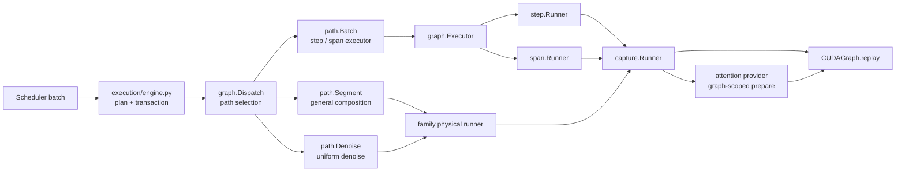

# UniServe CUDA Graph 执行架构

## 核心模型

UniServe 将一次 forward 表示为由 rows、segments、capacity 和动态 side tables 组成的执行计划。支持 `run_segment_graph` 的 family owner 可以用同一条 segment 路径执行任意合法的 active segment 组合，包括不同 phase、route 和模态同时存在的 mixed batch。step、span 和 denoise 是物理执行实现，不是顶层 batch 分类。

CUDA Graph identity 只描述稳定的物理执行路径和有限容量。request id、operation 组成、token 值、position、每个 segment 的 query 长度、cache length、block id、sampling state 和 route value 都是 replay 前刷新的动态输入。

## 模块职责

Graph 代码统一位于 [`execution/graph/`](../uniserve_worker/execution/graph/)：

| 模块 | 深层职责 | 对外 interface |
|---|---|---|
| [`bucket.py`](../uniserve_worker/execution/graph/bucket.py) | 定义有限容量 identity、power-of-two bucket 和 padding block 校验 | `Capacity`、`key`、`ceil`、`padding_blocks` |
| [`capture.py`](../uniserve_worker/execution/graph/capture.py) | 管理真实 graph state 的 capture/replay、稳定输入 buffer、warmup、失败分类和局部 retirement | `Runner`、`Event`、`record` |
| [`dispatch.py`](../uniserve_worker/execution/graph/dispatch.py) | 选择第一个接受计划的物理路径，发布本轮 capture policy，记录 path/capacity | `Path`、`Match`、`Dispatch` |
| [`path.py`](../uniserve_worker/execution/graph/path.py) | 将统一 forward plan 绑定到实际 owner 或 executor | `Segment`、`Batch`、`Denoise` |
| [`executor.py`](../uniserve_worker/execution/graph/executor.py) | 在共享 paged cache 执行面中选择 step 或 span 物理实现 | `Executor` |
| [`step.py`](../uniserve_worker/execution/graph/step.py) | 固定每 row 一个 query position 的 graph state、host/device refresh 和 paged-decode prepare | `Runner`、`State`、`Inputs` |
| [`span.py`](../uniserve_worker/execution/graph/span.py) | flat variable-span tokens、row boundaries、last-token projection 和 paged-varlen prepare | `Runner`、`State` |

`dispatch.Path` 是物理执行 seam：实现者只声明 `name`、`match`、`capacity` 和一次 `run`。capture 与 replay 是 `capture.Runner` 及其具体实现的内部生命周期，因此 dispatcher 不持有 graph executable，也不维护第二套 capture cache。

## 所有权与数据流



| 所有者 | 负责 | 不负责 |
|---|---|---|
| [`execution/engine.py`](../uniserve_worker/execution/engine.py) | group admission、`ForwardPlan`、`ForwardBatch`、path 装配、事务提交 | graph executable 和稳定 tensor 地址 |
| `graph.Dispatch` | path 顺序、capture policy、成功执行的 path/capacity metadata | capture/replay state 和模型 forward |
| `graph.capture.Runner` | graph executable、input refresh、capture/replay event、state retirement | operation 组成和 path 选择 |
| family owner | 任意合法 segment composition 的 packing、cache staging、visibility、route 和模型 traversal | 全局 path 选择 |
| attention provider | graph-scoped backend binding、paged plan refresh 和 kernel 几何 | request lifecycle 和 forward commit |

依赖方向由架构测试固定：graph 核心不导入模型，family compute 保持在 `models`，execution 通过 owner interface 调用 family 实现。

## 路径选择

[`ModelRunner._build_forward_graph_runner`](../uniserve_worker/execution/engine.py) 按以下顺序装配路径：

1. `Batch` 接受 token-span rows，并交给系统 `Executor` 或 owner 提供的 graph executor；`Executor` 根据实际输入几何选择 step 或 span。
2. `Segment` 接受拥有 `run_segment_graph` 的 owner 所支持的任意 active segment composition，包括 uniform 与 mixed composition。
3. `Denoise` 在 general segment owner 不可用时接受 uniform denoise plan，并交给共享的 batched step executor。

`Batch` 是 tensor rank、padding contract 与 attention kernel family 已完整确定时的窄路径。此后优先保留 `Segment` 的一般组合执行能力；`Denoise` 只补足没有 general segment owner 的 family。`Segment` 不按 operation 或模态被定义成特例，dispatcher 也不会为了命中窄路径而拆分一次 mixed forward。

`Dispatch.run` 对第一个 accepted path 执行一次 `run`。accepted path 返回 `None` 表示其物理执行未覆盖当前输入，整个 forward 按 policy 进入 eager fallback；dispatcher 不在已经开始执行的路径之后尝试另一个可能拥有不同副作用合同的 path。

成功结果携带 `GraphInfo {path, capacity}`。这份 metadata 描述实际选中的执行路径和容量，不声明本轮是 capture 还是 replay；真实 event 由物理 runner 在发生时记录。

## Capacity identity

[`bucket.Capacity`](../uniserve_worker/execution/graph/bucket.py) 包含：

- `path`：真实物理执行布局的稳定身份。
- `rows`、`segments`、`tokens`、`branches`、`blocks`：向上取有限 bucket 的容量轴。
- `dtype`、`device`、`backend`、`descriptor`：会改变 executable 或稳定 storage contract 的静态身份。

`Capacity` 不包含：

- operation mode、operation 排列或 request identity。
- segment class、route value 或模态标签。
- 每个 segment 的 `q_len`、prefix length、visible end 或 branch value。
- token、position、block id、cache length 或 sampling state。

字段能通过已有稳定 tensor 的 `copy_` 刷新，并且不改变 captured control flow、tensor rank、容量上界和 kernel family 时，它属于动态输入。字段改变稳定地址布局、容量上界、backend binding 或真实控制流时，它属于 capacity identity。

family-owned packed runner 可以在 `Capacity` 之外维护更细的内部 executable key，例如 visibility topology、owner/pool identity、promotion capacity 和 backend identity。这些 key 仍只描述物理 executable，不描述本轮 operation composition。

## Capture policy 与真实生命周期

`ForwardGraphPolicy.allow_capture` 由 `Dispatch` 写入当前 `ForwardContext.allow_capture`。所有继承 `capture.Runner` 的物理实现读取同一字段：

- 已存在 state 时，无论 `allow_capture` 是否为 false，都可以 refresh 并 replay。
- state 不存在且 `allow_capture` 为 false 时，runner 记录一次 miss 并返回 `None`。
- state 不存在且 `allow_capture` 为 true 时，runner 执行 warmup/capture、保存 state、refresh 并 replay。

capture permission 因而作用于真实 graph owner，对 segment、step、span、denoise 和 owner-managed batch 使用相同语义。

`capture.Runner` 的 state retirement 先同步 device，再销毁目标 executable 及其 graph-scoped backend binding，并清除 graph state 的最后一个 Python 引用；此后 `torch.cuda.empty_cache()` 只释放已经变成 unoccupied 的私有池 storage，其他 live graph 所拥有的 allocation 仍保持 occupied 和地址稳定。新 state 分配前，共享生命周期读取 device headroom；仅当空闲显存低于安全水位且 caching allocator 确有可回收块时，才提前同步并释放未占用缓存，避免 state 构造或 warmup 在到达 capture 边界前 OOM。完成 warmup 和输入准备后，capture 使用标准 `torch.cuda.graph()` 上下文同步并回收 warmup 留下的未占用 allocator cache，再从 runner 的共享 graph pool 捕获。已有 state replay 不查询或回收 allocator。

统计也遵循所有权：

- 物理 runner 记录 capture、replay、miss、fallback 和 padded/unpadded token。
- dispatcher 在成功后记录 path 和 capacity shape。
- eager fallback recorder 记录事务层 fallback。

每个事件只有一个所有者，避免同一次 capture/replay 在 dispatcher 与 runner 中重复计数。

## Step 与 span

`step.Runner` 的稳定 state 使用 `[rows, 1]` input/position tensors、paged block table、cache/KV sequence lengths 和 write locations。每次 replay 前，它从 device batch 或 pinned host inputs 刷新这些 buffers，并调用 paged-decode backend prepare。

`span.Runner` 的稳定 state 使用 flat tokens、`cu_seqlens_q`、query/KV lengths、last-token indices 和 paged-varlen backend binding。它按 token、row 和 max-KV capacity 选择 bucket，同一个 state 可以承载不同的 row span 分布。

`Executor` 只在共享 paged-cache 执行面上选择这两个物理实现：

- `ForwardMode.DECODE` 且输入第二维为 1 时进入 step。
- `ForwardMode.EXTEND` 或 `ForwardMode.MIXED` 时进入 span。

这个选择描述 tensor rank、padding contract 和 attention kernel family。顶层 graph 数据模型仍然是 rows、segments、capacity 和动态 side tables。

## Query 几何

每 row 一个 query position 与每 row 不同 query span 是 attention 几何，不是 CUDA Graph 顶层类型。设两个 batch 的 query lengths 分别为：

```text
A = [1, 1, 4]
B = [2, 2, 2]
```

两者都使用 3 个 active segments 和 6 个 query tokens，可以落入相同 segment/token capacity。replay 前刷新的 `cu_seqlens_q` 分别是 `[0, 1, 2, 6]` 和 `[0, 2, 4, 6]`，tensor identity 与 shape 保持不变。

[`ForwardGraphStreamState.refresh`](../uniserve_worker/runtime/forward_stream.py) 原位刷新 `cu_seqlens_q`、visible bounds、packed indexes 和 route indices；[`ForwardGraphPagedKVView.refresh`](../uniserve_worker/runtime/forward_stream.py) 原位刷新 block table、cache lengths、write locations 和 token indices。它们校验 capacity 与稳定 topology，不按逐 segment 的 `q_len` 分布建立 graph 类型。

attention provider 在 replay 前根据这些 side tables 更新 graph-scoped plan。模型的 `query_geometry` hook 只提供 head count、scale 和 dtype 等 attention 静态几何。

## Capture body 的时间边界

Replay 前执行：

- 从 `ForwardPlan` 和 request state 构造动态输入。
- 将 token、position、segment/query boundaries、KV mapping 和 route indices 写入稳定 buffers。
- 调用 attention backend 的 graph-safe prepare。

Captured body 内执行：

- 一次物理模型 forward traversal。
- attention、MLP、route dispatch、KV writes 和明确捕获的 device-side promotion。

Replay 后执行：

- 从 graph-owned output 投影有效 rows。
- sampling、relay publication、logical cache advance、denoise update 和 commit publication。
- Scheduler transition 与 request completion。

请求状态与 graph state 具有独立寿命。请求完成会释放其逻辑状态和 residency；相同 path/capacity 的 graph state 可以服务后续请求。

## 维护不变量

修改 graph 代码时必须保持：

1. 支持 general segment execution 的 owner 对任意合法 active segment composition 只执行一次模型 traversal。
2. `bucket.py`、`capture.py` 和 `dispatch.py` 不按 mode、modality、unit query 或 ragged query 建立 identity。
3. 相同 path/capacity、不同 `cu_seqlens_q` 分布复用同一物理 state。
4. 动态输入原位刷新，capture 后不替换 captured tensor 对象。
5. attention provider 在每次 replay 前准备本轮 plan，不读取 capture-time page/query values。
6. `allow_capture=false` 阻止新 state capture，但允许已有 state replay。
7. dispatcher 不持有 graph executable 或第二套 graph cache。
8. graph replay 成功后才提交 request-side cache、relay、latent 和 output state。
9. replay 不触碰 allocator；新 state 在 headroom 不足时于分配前提前回收，并在 warmup 后的标准 capture 边界回收 unoccupied cache；retirement 只在同步、销毁 executable 并释放最后引用后回收其 storage，不改变其他 live graph 的 captured address。
10. capture/replay event 由物理 runner 记录一次，path/capacity 由 dispatcher 记录一次。

对应测试位于 [`tests/python/architecture/test_layering_contract.py`](../tests/python/architecture/test_layering_contract.py)、[`tests/python/unit/execution/graph/test_capture.py`](../tests/python/unit/execution/graph/test_capture.py)、[`tests/python/unit/execution/graph/test_dispatch.py`](../tests/python/unit/execution/graph/test_dispatch.py)、[`tests/python/unit/core/test_forward_stream.py`](../tests/python/unit/core/test_forward_stream.py)、[`tests/python/unit/execution/test_packed_graph.py`](../tests/python/unit/execution/test_packed_graph.py) 和 [`tests/python/integration/runtime/test_cuda_graph_replay.py`](../tests/python/integration/runtime/test_cuda_graph_replay.py)。
