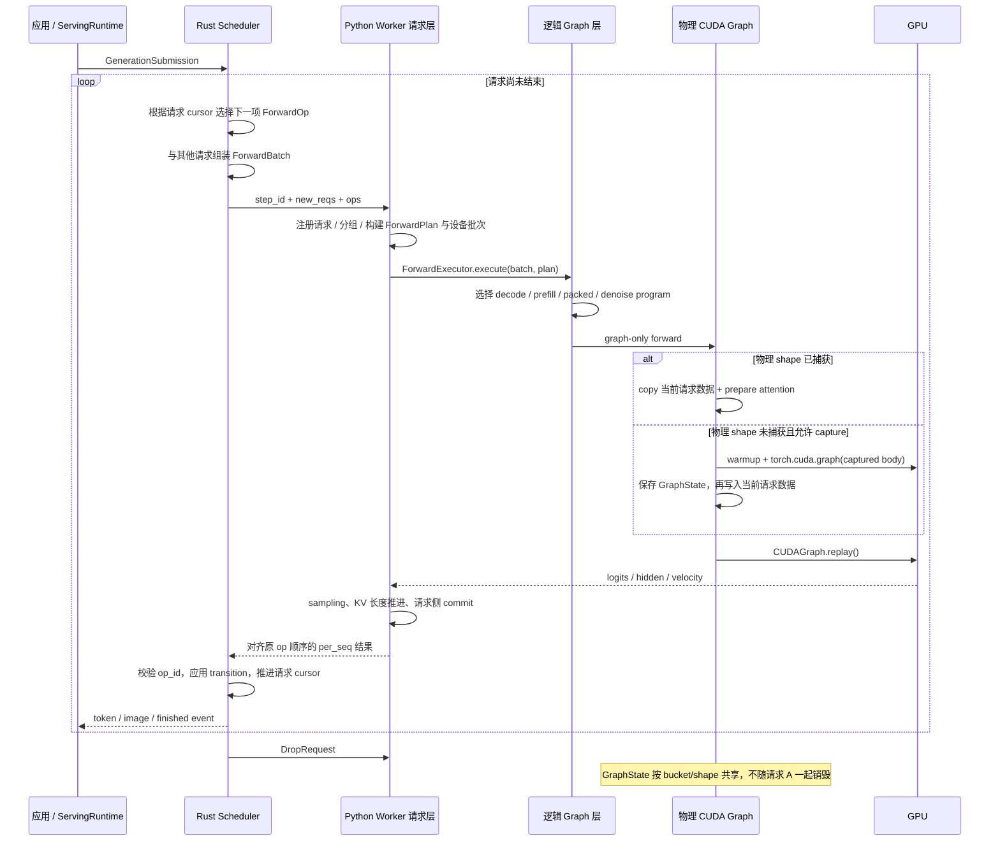

# UniServe CUDA Graph 阅读路线：跟随一次请求理解整个系统

## 先抓住唯一主线

理解 UniServe CUDA Graph 的正确入口不是 `torch.cuda.CUDAGraph`，而是一条应用请求如何反复变成 GPU 工作、结果又如何推动请求进入下一状态。CUDA Graph 只是 Worker 执行一次 forward 时采用的提交机制；它不创建请求、不决定请求下一步做什么，也不拥有请求生命周期。

全文只跟随一个文本请求 A：它先执行 prompt prefill，随后执行若干次 decode，最后因 EOS 或 token 上限结束。理解这条闭环后，再把请求 B 加入同一批次，就能自然理解 mixed forward；再把文本、denoise 和 commit 行放进同一批次，就能理解 packed graph。

最重要的结论是：**请求不拥有 CUDA Graph。请求数据被写入 Graph 拥有的稳定缓冲区；请求结束后它的状态和 KV 资源会释放，但按 shape/bucket 捕获的 Graph 通常继续服务其他请求。**

## 一张图：一次请求的一轮是如何闭环的



读任何 CUDA Graph 代码时都要问：当前代码位于这张图的哪一段？它操作的是请求状态、一次批次快照，还是跨请求复用的 Graph 状态？

## 先区分五种寿命不同的对象

| 对象 | 代表什么 | 何时创建与销毁 | 是否属于某个请求 |
|---|---|---|---|
| `ServeRequest` / `GenerationRequest` | 用户意图、prompt、采样和终止策略 | 应用接收请求时创建，流结束时完成 | 是 |
| Scheduler `ReqState` 与 cursor | 请求当前处于 prefill、decode、denoise、commit 中的哪一步，以及下一步可执行什么 | Scheduler admission 后存在，finish/cancel 时释放 | 是 |
| Worker [`RequestState`](../uniserve_worker/runtime/request_state.py#L104) | 采样参数、block ids、KV 长度、decode relay、latent 等设备侧请求控制状态 | `new_reqs` 首次到达时创建，`DropRequest` 时删除 | 是 |
| `ForwardPlan` / Python `ForwardBatch` | 某一个调度 step 在 Worker 中的不可变语义计划和设备张量快照 | 每个执行 group 重建，用完即释放 | 属于一次批次，不属于单个请求 |
| `TextDecodeGraphState` 等物理 GraphState | 稳定输入地址、attention binding、输出缓冲区和真实 `torch.cuda.CUDAGraph` | Worker warmup 或首次遇到 shape 时创建；跨请求复用，失效、退役或 Worker 退出时销毁 | 否 |

请求生命周期沿时间轴向前推进；Graph 生命周期沿 shape/bucket 复用。整个设计就是在二者交叉时，把本轮请求数据安全地装进一个长期存在的 GraphState。

## 第 0 站：应用启动时，Graph 系统已经被装配

应用侧构建 [`ServingRuntime`](../crates/frontend/serving/src/lib.rs#L1284)，Worker 侧构建 `ModelRunner`。当模型声明系统可管理的 KV cache、设备是 CUDA 且配置启用 Graph 时，[`ModelRunner._build_text_execution`](../uniserve_worker/execution/engine.py) 创建一个 [`TextGraphRunner`](../uniserve_worker/execution/cuda_graph.py)，其中包含 decode 和 prefill 两类物理 runner。

随后 [`TextGraphRunner.warmup`](../uniserve_worker/execution/cuda_graph.py) 可以用合成输入预先捕获配置中的 bucket。这样真实请求第一次命中某个 bucket 时直接 replay；若某类 runner 允许 lazy capture，则缺失的 shape 也可能由首个真实请求触发 capture。prefill 在启用 warmup 时对未预捕获的完整物理 key 直接报 miss，而不是临时捕获，具体判断在 [`PrefillCudaGraphRunner.maybe_run`](../uniserve_worker/execution/cuda_graph.py)。

这一站只需得到两个认识：Graph runner 是模型/Worker 级服务；warmup 决定请求到来之前有哪些物理 shape 已经存在。

## 第 1 站：请求从应用进入 Scheduler，此时还没有 CUDA Graph 概念

[`ServingRuntime.serve`](../crates/frontend/serving/src/lib.rs#L1805) 注册应用请求、编译执行计划并交给 engine gateway。普通文本请求在 [`lower_text_request`](../crates/frontend/serving/src/text/lower.rs#L27) 中被 tokenization 后降为包含 context、sampling、stop、cache policy 和资源上界的 `GenerationRequest`，再作为 `GenerationSubmission` 进入 Scheduler。

这一层不应知道 batch bucket、Graph key、静态张量地址或 attention backend。它只描述“请求要生成什么”。

阅读目标：能回答 prompt token、最大生成长度、采样参数和停止条件在哪一层形成；同时确认这些文件没有调用任何 CUDA Graph API。

## 第 2 站：Scheduler 把一个长请求拆成连续的 GPU 操作

一个生成请求不会作为完整任务一次交给 Worker。Scheduler 保存请求 cursor，并在每个调度周期选择当前可执行的一个或一组操作。主循环 [`step_nonblocking`](../crates/engine/scheduler/src/scheduler.rs#L1787-L1821) 依次处理已完成结果、取消、admission、batch assembly 和 submission。

对请求 A，最小文本路径可以想成：

```text
应用请求 A
  -> PrefillUnd(prompt chunk)
  -> DecodeUnd(next token)
  -> DecodeUnd(next token)
  -> ...
  -> EOS / max tokens
  -> Finished + DropRequest
```

[`assemble`](../crates/engine/scheduler/src/scheduler.rs#L2667) 与 [`assemble_pass`](../crates/engine/scheduler/src/scheduler.rs#L2752-L2897) 从所有 ready 请求中选择操作并形成一批；[`submit_batch`](../crates/engine/scheduler/src/scheduler.rs#L3371-L3525) 为每个操作分配 `op_id`、登记 in-flight transition，并构造发给 Worker 的 wire batch。

Wire contract 是一个 stateful diff，而不是每步重发完整请求：

- [`NewRequestData`](../crates/protocol/worker-wire/src/lib.rs#L44) 在请求本次驻留期间首次派发时携带采样、初始 block ids、LoRA、图像参数等相对静态的信息；preemption/drop 结束 Worker 驻留后，后续恢复会重新注册。
- [`ForwardOp`](../crates/protocol/worker-wire/src/lib.rs#L80) 每个 step 携带本轮动态增量，例如 `kind`、`pos_range`、token ids、new block ids、CFG、decode burst 和 per-step mask。
- Rust wire [`ForwardBatch`](../crates/protocol/worker-wire/src/lib.rs#L197) 只是 `{step_id, new_reqs, ops}`，它不是随后传给模型的 Python `ForwardBatch`。

CUDA Graph 的第一个上游影响在这里出现：Scheduler 决定哪些请求在同一时刻成为同一批次，因此它创造了 pure decode、pure prefill、mixed text 或跨模态 packed execution 的机会；但 Scheduler 不选择具体 Graph 类，也不计算物理 Graph key。

阅读目标：对请求 A 的第一轮和第二轮分别写出 `ForwardOp.kind`、`pos_range`、`token_source`，并解释为什么第二轮不需要重新发送完整请求状态。

## 第 3 站：Worker 把 wire 操作变成一次可执行快照

Worker dispatch 最终进入 [`ModelRunner.execute`](../uniserve_worker/execution/engine.py)，先由 [`ExecuteBatch.from_wire`](../uniserve_worker/contracts/batches.py#L34) 解析边界，再交给 [`ForwardStepExecutor.execute`](../uniserve_worker/execution/engine.py)。

一次 step 在 Worker 中经历以下转换：

```text
Rust ForwardBatch {new_reqs, ops}
  -> ExecuteBatch                         边界解析
  -> RequestStateTable                   首次注册或接收动态增量
  -> UniForwardBatch                     按 op mode 提供请求视图
  -> ForwardPlan                         行、segment、输出槽、shape、Graph policy
  -> Python ForwardBatch                 本轮真正送进执行层的设备张量快照
```

具体阅读顺序如下：

1. [`ModelRunner._register_new_reqs`](../uniserve_worker/execution/engine.py) 把 `NewRequestData` 放入 Worker [`RequestStateTable`](../uniserve_worker/runtime/request_state.py#L185)。
2. [`ForwardGroupPlanner`](../uniserve_worker/execution/engine.py) 决定 Scheduler 给出的 ops 是否保持为 whole-batch mixed group，或按模型的 `BatchPolicy` 分组。
3. [`ForwardPlanBuilder`](../uniserve_worker/execution/engine.py) 将每个 op 固化为 row、segment、cache span、output slot 和 shape summary。
4. [`ForwardBatchBuilder`](../uniserve_worker/execution/engine.py) 将计划物化成内部 [`ForwardBatch`](../uniserve_worker/contracts/forward_batch.py#L182)，包括 `input_ids`、`positions`、segment、last-token index 和 attention plan。
5. [`ForwardStepExecutor._execute_unified_group`](../uniserve_worker/execution/engine.py) 把 plan、batch、请求状态句柄和 postprocess callback 一起交给执行器。

这里必须区分“持久请求状态”和“本轮设备快照”：`RequestState.block_ids` 可以跨 step 增长，而 `ForwardBatch` 只描述当前 group；Graph 层消费后者，但通过 plan/runtime handles 在成功后更新前者。

阅读目标：任选请求 A 的一次 decode，沿代码写出 `req_id`、本轮 token、position、block table、KV length 分别从哪里来，又落入哪个对象。

## 第 4 站：逻辑 Graph 层决定本轮应该走哪一种程序

[`ForwardExecutor.execute`](../uniserve_worker/execution/engine.py) 是 Graph-first 策略门：在 policy 允许时先调用 [`CudaGraphForwardRunner.run`](../uniserve_worker/execution/cuda_graph.py)，成功则直接返回 `ForwardResult`，miss 或异常则按 strict/fallback policy 处理。

`CudaGraphForwardRunner` 遍历注册的 `ForwardGraphProgram`，根据完整 `ForwardPlan` 选择语义路径。注册顺序可从 [`ModelRunner._build_forward_graph_runner`](../uniserve_worker/execution/engine.py) 看到：系统 text decode/prefill、packed visible、model-owned text、pure denoise。

| 本轮 Worker group | 首个匹配的逻辑 program | 接下来进入的物理系统 |
|---|---|---|
| 全部是普通 text decode | `DecodeGraphProgram` | system-owned decode graph |
| 全部是 text extend/prefill | `PrefillGraphProgram` | system-owned prefill graph |
| text extend 与 decode 混合 | `PrefillGraphProgram` | 同一个 system-owned prefill graph 系统 |
| self-managed KV 模型的纯文本 | `ModelOwnedTextGraphProgram` | 模型暴露的 interleaved text graph adapter |
| text 与 denoise/commit 同批 | `PackedVisibleGraphProgram` | packed mixed graph |
| 全部是单步 denoise | `DenoiseStepGraphProgram` | denoise-step graph |

[`CapturedForwardGraph`](../uniserve_worker/execution/cuda_graph.py) 只是逻辑 program 和 `ForwardGraphShapeKey` 的缓存包装；它不包含真实 CUDA executable。真实 `torch.cuda.CUDAGraph` 位于 `TextDecodeGraphState`、`TextInitialPrefillGraphState`、`PackedMixedGraphState` 或 `DenoiseStepGraphState`。

阅读目标：给定一个 `ForwardPlan`，先预测哪个 `can_run` 返回 true，再读 [`programs.py`](../uniserve_worker/execution/cuda_graph.py) 验证。此时不要进入物理 capture 代码。

## 第 5 站：请求 A 的一次 decode 如何真正 replay

假设当前 batch 有 A、B、C 三个 decode 请求，而 decode runner 已经捕获容量为 4 的 bucket。应用和 Scheduler 看到三个独立请求；逻辑层看到一个 pure-decode plan；物理层只看到“3 个有效 row 写入一个容量为 4 的静态拓扑”。

完整调用链是：

```text
ForwardExecutor.execute
  -> CudaGraphForwardRunner.run
  -> DecodeGraphProgram.capture/replay
  -> TextDriver.forward_graph_result
  -> TextDriver.forward_logits_graph
  -> TextDriver._forward_graph_with_optional_padding_reorder
  -> TextDriver._forward
  -> TextDriver._forward_batched
  -> TextDriver._run_model_forward
  -> TextGraphRunner.maybe_run
  -> TextGraphRunner._maybe_decode
  -> DecodeCudaGraphRunner.maybe_run
  -> _GraphRunnerBase._capture_or_replay
  -> state.graph.replay()
```

按以下顺序阅读物理代码：

1. [`TextDecodeGraphState`](../uniserve_worker/execution/cuda_graph.py) 持有 bucket 大小、稳定的 token/position/block/length tensors、paged cache、attention plan/binding、输出 logits 和真实 `CUDAGraph`。
2. `DecodeCudaGraphRunner.resolve_bucket` 在已有 state 与配置 bucket 中选择能容纳 live batch 的最小容量；请求 ID 不参与物理 key。
3. [`DecodeCudaGraphRunner.maybe_run`](../uniserve_worker/execution/cuda_graph.py) 把当前 batch 及 capture、copy、prepare、replay callbacks 交给共享模板。
4. [`_GraphRunnerBase._capture_or_replay`](../uniserve_worker/execution/cuda_graph.py) 先查 `states[key]`，必要时捕获，然后每次都 copy 当前输入、刷新 attention backend 状态并 replay。
5. [`copy_text_decode_graph_inputs`](../uniserve_worker/execution/cuda_graph.py) 用 `copy_`/原位更新把 A、B、C 的 token、position、page mapping 和长度写进容量为 4 的稳定 buffers，并填充第 4 行。
6. [`_replay_decode_graph`](../uniserve_worker/execution/cuda_graph.py) 调用 `state.graph.replay()`，随后只返回 `state.logits[:live_batch_size]`。

如果 state 不存在，[`_capture_graph_state`](../uniserve_worker/execution/cuda_graph.py) 会在独立 stream 上 warmup，重新 copy/prepare 后进入 `torch.cuda.graph(state.graph)` 捕获 `model.forward`。capture 结束后，`_capture_or_replay` 仍会重新装载真实请求数据并执行一次 replay，因此 lazy 首次命中是“capture + replay”，不是把 capture 期间的输出直接当作本轮结果。

`TextGraphRunner._decode_forward` 构造的捕获批次甚至使用 `0..batch_size` 的占位 req ids；真实请求身份只在 Graph 外用于 row 对齐、采样和状态推进。这是“Graph 属于拓扑而不属于请求”的直接证据。

阅读目标：画出容量 4 的 `input_ids`、`positions`、`block_table` 与 `logits`，标记哪些地址固定、哪些值每轮变化、哪里发生 padding、哪里切回 3 个有效 row。

## 第 6 站：Graph 输出如何变成请求的下一步

CUDA Graph 只产出 logits、hidden 或 velocity；它没有完成请求状态迁移。普通文本结果进入 [`ForwardPostprocessor.apply`](../uniserve_worker/execution/engine.py)，随后执行 batched sampling、发布 decode relay、更新 Worker request 的 KV length，并把输出规范化为与原始 ops 一一对齐的 `per_seq` 结果。文本 KV 长度的提交点是 [`_advance_text_kv_lengths`](../uniserve_worker/execution/engine.py)。

结果返回 Scheduler 后，[`apply_result`](../crates/engine/scheduler/src/scheduler.rs#L2068-L2273) 按 `req_id + op_id` 找到准确的 in-flight transition，先验证 Worker 结果，再将 transition 应用到请求 cursor，释放本轮预留资源，最后 emit token/image event。下一次 `step_nonblocking` 再根据推进后的 cursor 产生请求 A 的下一个 `ForwardOp`。

因此一次 decode 的因果闭环是：

```text
Scheduler 当前 cursor
  -> 本轮 ForwardOp
  -> Graph replay 得到 logits
  -> sampling 得到 token
  -> Worker 更新 KV/relay
  -> Scheduler 校验并推进 cursor
  -> 下一轮 ForwardOp 使用刚产生的 token 与 position
```

请求结束时，[`finish_with`](../crates/engine/scheduler/src/scheduler.rs#L4907-L4973) 释放 Scheduler 资源、发送 finished event，并向 Worker 发出 `DropRequest`；[`ModelRunner.drop_request`](../uniserve_worker/execution/engine.py) 删除模型请求状态、accounting 和 `RequestState`。它没有删除 `DecodeCudaGraphRunner.states`，所以相同 bucket 可被未来请求继续 replay。

阅读目标：从 `state.logits` 一直跟到 Scheduler cursor 的下一状态，并明确每个副作用发生在 replay 前、captured body 内、replay 后 Worker 侧还是 Scheduler 侧。

## 用同一条主线理解 mixed text forward

现在加入请求 B：A 已处于 decode，只需要一个新 token；B 刚进入或仍在 chunked prefill，需要多个新 token。若 Scheduler 配置允许，它在 decode lane 的 [`mixed_prefill_tokens` 路径](../crates/engine/scheduler/src/scheduler.rs#L2763-L2897) 中把 B 的小块 prefill 作为 rider 放到 A 的 decode batch，wire 中仍然只是两个独立 `ForwardOp`。

Worker 中发生四步：

1. `ForwardGroupPlanner` 仅在模型 `BatchPolicy` 和 whole-batch forward adapter 都支持时保留 mixed group；否则它按可执行边界分组，或在已承诺 whole-batch 但没有执行器时拒绝。
2. `ForwardPlanBuilder` 得到 `ForwardMode.MIXED`，其中 A 的 query length 是 1、cached prefix 非零，B 的 query length 大于 1、cached prefix 可为零或非零。
3. `DecodeGraphProgram` 因为不是 pure decode 而拒绝；`PrefillGraphProgram` 因为所有 row 都是 text 且 token count 非零而接受。
4. [`TextGraphRunner.maybe_run`](../uniserve_worker/execution/cuda_graph.py) 将 `EXTEND` 和 `MIXED` 都路由到 `_maybe_prefill`。

物理表示可以简化为：

```text
A: decode, q_len=1, cached_len=100
B: extend, q_len=5, cached_len=20

flat query tokens = 6
query lengths     = [1, 5]
KV lengths        = [101, 25]
last-token rows   = [A 的第 1 个 query, B 的第 5 个 query]
```

对 varlen prefill attention 来说，decode row 只是 `q_len=1` 且具有 cached prefix 的一行，因此无需在一次 mixed batch 内先跑 decode graph、再跑 prefill graph。整个 group 使用一个 prefill physical state，其 key 由 padded token count、row bucket 和 max-KV bucket 等维度组成；每行的实际 query/context 长度通过动态 plan buffers 更新。

这里要区分两个概念：**mixed text** 是 extend 与 decode 行共享 varlen prefill 拓扑；**packed mixed** 是 text 与 denoise/commit segment 共享一个多模态 decoder 拓扑。二者都来自 Scheduler 的跨请求组批，但物理 GraphState、key 和 postprocess 完全不同。

阅读 mixed 的最短顺序是：Scheduler `assemble_pass` → `ForwardGroupPlanner.groups` → `PrefillGraphProgram.can_run` → `TextGraphRunner.maybe_run` → [`PrefillCudaGraphRunner.maybe_run`](../uniserve_worker/execution/cuda_graph.py) → [`test_text_graph_runner_routes_mixed_extend_decode_to_prefill_runner`](../tests/python/integration/runtime/test_cuda_graph_replay.py#L680)。

## 从请求场景扩展到其他 Graph 家族

| 应用/请求场景 | 请求循环中的特殊点 | 逻辑入口 | 物理入口 | 最后再读的内容 |
|---|---|---|---|---|
| 普通单 token decode | 每轮结果决定下一轮 token | `DecodeGraphProgram` | [`DecodeCudaGraphRunner`](../uniserve_worker/execution/cuda_graph.py) | host staging、buffer sharing、backend-specific prepare |
| prompt、chunked prefill、mixed text | 每行 query 长度不同，但都能表达为 varlen extend | `PrefillGraphProgram` | [`PrefillCudaGraphRunner`](../uniserve_worker/execution/cuda_graph.py) | token/row/max-KV 三维 key 与 padding row |
| decode burst | 一个 Scheduler op 请求多个顺序相关 token | text program 的 graph-only burst path | 同一个 one-token decode graph 被多次 replay | [`DecodeBurstExecutor`](../uniserve_worker/execution/decode_burst.py#L20-L205)；理解它为何在 replay 之间 sampling、更新 relay 和 position，而不是捕获一个 N-token Graph |
| self-managed KV / interleaved model | 模型的 modality FSM 与 cache 所有权无法交给通用 text runner | `ModelOwnedTextGraphProgram` | [`InterleavedTextPrefillGraphRunner`](../uniserve_worker/models/interleaved_text.py) 与 [`InterleavedTextDecodeGraphRunner`](../uniserve_worker/models/interleaved_text.py) | model-owned cache commit 与 homogeneous batch 限制 |
| text 与 denoise/commit 同一 forward | 不同请求/阶段的 segment 进入同一个 decoder launch | `PackedVisibleGraphProgram` | [`PackedMixedGraphRunner`](../uniserve_worker/models/packed_forward.py) | [`PackedMixedForward`](../uniserve_worker/models/packed_forward.py) 中的 packing、visibility、KV promotion、scatter 和各类 commit |
| pure denoise step | 请求 cursor 按 timestep 前进，输出是 velocity/latent update | `DenoiseStepGraphProgram` | [`DenoiseStepGraphRunner`](../uniserve_worker/models/interleaved_image.py) | CFG branch packing、输出 clone 与 latent accept-update |
| pure encode、pure commit 或不满足 eligibility 的形状 | 不一定属于通用 Graph program 的覆盖面 | delegated/private/eager path | 无统一物理 runner | 先确认 policy 与 adapter ownership，不要假设所有 GPU 工作都必须由这套 Graph 覆盖 |

每读一个新家族，都重复同样六个问题：Scheduler 为什么产生这种 group？Worker 用什么 plan 表达它？逻辑 program 为什么接受？物理 key 是什么？哪些请求值写入稳定 buffers？replay 成功后谁提交请求状态？

## 三道门决定一次请求能否 replay

Graph 命中不是一个布尔开关，而是请求在生命周期中连续通过三道门：

1. **Scheduler 组批门：** 当前 ready 请求是否形成一个有 Graph 表达的 pure 或 mixed topology。
2. **Worker 语义门：** `BatchPolicy`、`ForwardGroupPlanner` 和 `ForwardGraphProgram.can_run` 是否接受完整 group，是否存在 speculative tokens、burst、unsupported row 或 delegated mode。
3. **物理执行门：** 对应 runner 是否启用，设备和 paged cache 是否匹配，attention backend 是否提供 graph-safe prepare，物理 key/bucket 是否存在或允许 capture。

任何一门失败都会返回 miss 或抛出分类异常，最终由 [`ForwardGraphPolicy`](../uniserve_worker/contracts/forward_batch.py) 与 `ForwardExecutor` 决定 eager fallback 还是 strict failure。当前 `ModelRunner` 在非 simulation 模式下构造 strict policy，因此不能把 miss 理解成“生产环境总会自动跑 eager”；先检查 mode 是否把 Graph 选择委托给 adapter，以及当前 policy 是否允许 capture/fallback。

共享物理模板 [`_GraphRunnerBase`](../uniserve_worker/execution/cuda_graph.py) 只统一 capture/replay、输入刷新、backend prepare、统计和失败分类。每个家族仍负责自己的 eligibility、key、静态 state、动态 copy、输出切片和 post-replay commit。

## 实际阅读顺序

### 第一遍：只建立请求闭环

依次阅读 `ServingRuntime.serve`、`lower_text_request`、Scheduler `step_nonblocking/assemble/submit_batch/apply_result/finish_with`、wire `NewRequestData/ForwardOp/ForwardBatch`。先不打开任何 `graph/` 文件。

完成标准：你能用请求 A 解释为什么 prefill 和每次 decode 是不同 `ForwardOp`，以及 Worker 结果如何决定下一轮操作。

### 第二遍：只建立 Worker 数据变换

依次阅读 `ModelRunner.execute/_register_new_reqs`、`ForwardStepExecutor`、`ForwardGroupPlanner`、`ForwardPlanBuilder`、`ForwardBatchBuilder`、`ForwardPostprocessor`。

完成标准：你能区分 Scheduler 请求状态、Worker `RequestState`、本轮 `ForwardPlan` 和本轮设备 `ForwardBatch`，并说明它们分别由谁推进。

### 第三遍：跟一次普通 decode replay

沿“第 5 站”的完整调用链读到 `state.graph.replay()`，随后沿“第 6 站”读回 Scheduler `apply_result`。第一遍忽略 metrics、host staging、warmup bucket 枚举、graph memory pool 和异常分类。

完成标准：你能画出 live batch=3、bucket=4 的稳定地址与动态值，并指出真实 req id 为什么不需要进入 captured body。

### 第四遍：在同一闭环中加入请求 B

只研究 A=decode、B=extend 的 mixed text 场景，从 Scheduler assembly 读到 prefill graph replay，再读回两个请求各自的结果与 cursor。

完成标准：你能解释 mixed 是 Scheduler 产生的 batch topology，而不是 CUDA Graph 自己把两种请求拼起来；也能解释为什么它复用 prefill 而非 decode topology。

### 第五遍：按应用场景选择一个专用家族

只有当普通 decode 和 mixed text 都能完整闭环后，才选择 model-owned interleaved、packed text+denoise 或 pure denoise 之一。不要从 `packed_visible.py` 开始学习 CUDA Graph，它同时包含最复杂的 topology、cache promotion 和 postprocess。

完成标准：你能用同样的六个问题描述所选家族，并指出它与 system-owned text path 的唯一关键差异。

## 读代码时使用这一条跟踪记录

每次只记录一个请求的一轮，不要记录整个类树：

```text
request id:
应用请求目标:
Scheduler 当前 phase/cursor:
ForwardOp kind / pos_range / token_source:
同批其他 rows:
Worker ForwardMode 与 plan shape:
逻辑 program:
物理 Graph key/bucket:
GraphEvent: capture / replay / miss / fallback:
动态输入刷新位置:
captured numerical body:
post-replay Worker side effects:
Scheduler transition:
下一轮操作或 finish:
```

先为请求 A 的第一次 prefill 填一张，再为一次普通 decode 填一张，最后为 A=decode、B=extend 的 mixed batch 各填一张。四张记录能串起来时，UniServe CUDA Graph 的架构、机制、策略和主要执行变体就已经形成一个统一模型。
