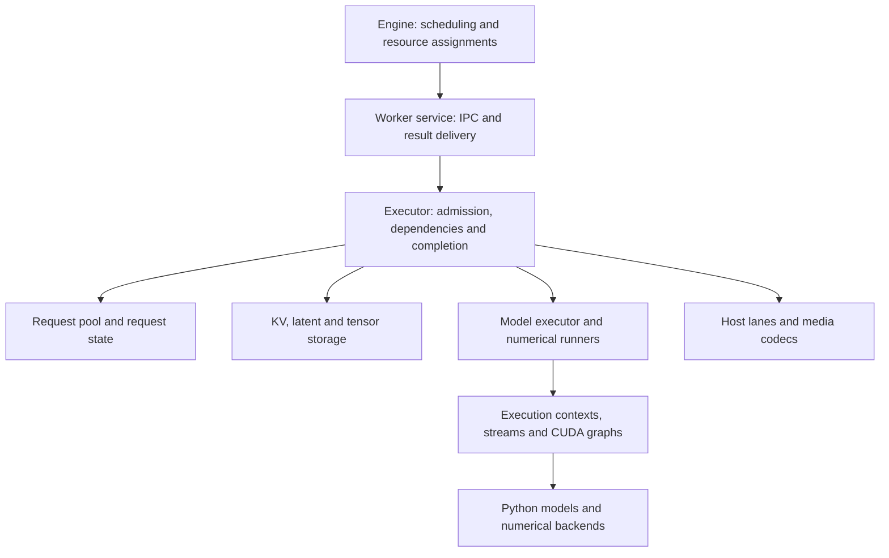

# Execution

UniServe's Rust engine schedules requests, places work and assigns logical resources. Each worker's Rust runtime owns request progress, batch execution, physical storage, streams, communication and retirement. Ordinary Python/PyTorch modules supply numerical computation: model composition, tensor operations, attention and expert kernels, sampling formulas, diffusion schedules and solver updates. Direct Python execution and serving use the same models, resource owners and numerical methods.

## Ownership

| Owner | Objects and responsibilities |
| --- | --- |
| `Worker` | The rank's configuration, process groups, model executor, request storage, pools, transports and executor. An IPC endpoint is borrowed from its caller. |
| `Service` | Typed rank requests, pending submissions, result delivery and close/fatal admission policy. It borrows the executor and channel for one run. |
| `Executor` | Bounded batch admission, dependencies, launch order, result acceptance and physical retirement. Direct calls and serving share this implementation. |
| `RequestPool` | Request epochs, engine-assigned slots, pending calls and accepted progress. `RequestSlots`, `DecodeState`, `CanvasSlots` and `DiffusionState` own their corresponding state banks. |
| `BatchState` | The decoded call plan, request index, input leases, numerical inputs and aligned pending outputs through delivery or abandonment. |
| `ModelExecutor` | Component bindings, ordinary model modules, numerical runners, execution lanes, startup preparation and graph storage. |
| `ModelRunner` | Common execution resources and graph dispatch. `TextRunner`, `CanvasRunner`, `EncoderRunner` and `DiffusionRunner` add the behavior of their numerical operation. |
| `ExecutionContext` | Prepared computational-layer bindings, numerical plans and borrowed workspace. `DeviceTransfers` owns scoped cross-device delivery streams. |
| `CUDAStream` | An execution stream, optional Green Context SM partition, event rings and `StreamCommunication`. Graphs and contexts borrow these resources. |
| `GraphStorage` | Shared allocation pools and startup budgets. `Execution` and `CUDAGraph` retain graph executables, inputs and outputs. |
| `InputBuffers`, `HostBuffers`, `OutputPool` | Fixed device columns, reusable host copy sources and bounded result readback storage. Each has its own reuse conditions. |
| `KVCacheManager`, `BlockTables`, `LatentPool` | Physical KV access tracking, assigned page tables and latent trajectories. The engine retains logical allocation policy. |
| `TensorStore`, `BufferPool` | Cross-call tensor visibility, imports, readers and physical product backing. |
| `Transport`, `BufferRegistry`, `TransferPool` | Source exports, read grants, bounded transfer work and backend retirement. A `TransferTicket` distinguishes a usable result from completed physical access. |
| `HostLane` | Bounded native host work shared by input preparation, copies and codecs. `MuxSession` retains one request's incremental media container. |

The engine assigns capacity and placement; workers bind those assignments to physical storage. A model consumes borrowed numerical inputs and bound computational layers. It does not own request slots, pool allocation, stream selection, graph policy or retirement. Communication that expresses model partitioning remains numerical computation; creating groups, ordering concurrent invocations and retaining communication buffers belong to the runtime.

## Placement and startup

Rust resolves launch descriptors before model loading: device selection, expert roles, component membership, transport selection and execution settings. The Python loading interface receives immutable records. Checkpoint loading and numerical module inspection remain ordinary Python library operations.

The native launch entry binds the rank endpoint and reports it to the head before loading weights. Engine and worker share the `RankReport` message. TCP registration advertises the local interface used to reach the head; shared storage uses a unique service name. The launch scope closes a constructed worker before its endpoint, including startup failures. After warmup, the head coordinates shutdown across ranks; handled SIGINT and SIGTERM leave that collective shutdown to the head.

`ComponentConfig`, `ParallelConfig` and `SequenceConfig` expose the same native placement values used by the engine. Parsing rejects invalid membership and parallel degrees before collective creation. Ordered ranks map to the mesh axes `pp`, `cp`, `tp`, `ulysses`, with the last axis varying fastest. Input ranks belong to the first pipeline stage. Output ranks belong to the last stage, retaining each sequence shard and only tensor-parallel coordinate zero.

`ProcessGroups` owns groups it creates and borrows an existing process world when supplied. Independent attention replicas can share an expert union; component membership remains relative to each worker's rank list. Components are bound in sorted name order so group creation occurs in the same collective order on all required ranks. Only communication axes used by numerical methods are bound; text sampling also needs its tensor-parallel group. A temporal component executes units on rank-local numerical meshes and uses an ordered ring for reconstruction overlaps. Host codecs execute their units independently.

`ComponentBinding` retains placement on every rank for routing and capacity calculation. Member ranks additionally borrow numerical calls, their mesh and participation groups. `media_units(cursor, count)` assigns consecutive runs of `units_per_rank` using component rank order; an idle member owns an empty run. Python resolves numerical methods from ordinary module declarations. Rust validates their placement on a meta-device skeleton before weight loading and process-group creation, then binds each local call to its pipeline stage and borrowed communicators.

Native call classification derives advertised operations and media routes from those declarations. Ambiguous media operations have no single component route; the engine checks that the complete deployment provides each required operation. Host readers, codecs and muxers use the same operation table for placement, binding and reporting.

`WorkerConfig` is an immutable native value shared by execution and capacity planning. Launch parsing resolves execution-lane selectors once. `config.replace(...)` derives another configuration; backend-specific numerical options stay with their backend. Native capacity planning produces a `WorkerLayout` and advertised `WorkerInfo` before allocation. KV sizing charges persistent inputs, state, import workspace, graph padding and graph storage before assigning remaining whole units. Ranks sharing storage choose the smallest fitting unit count. An explicit capacity must fit the same budget.

Media capacity uses the numerical state and output layouts at each admitted concurrency. The output horizon can change with concurrency, so fitting does not assume monotonic memory usage. Ranks reduce the vector of fitting candidates and choose their greatest common count. `MediaBuilder` owns frame and text capacities, startup layouts, sample page ranges and request-slot descriptions. Native startup selects the denoiser placed by the deployment and derives frame and condition capacity from its numerical declarations. It does not retain an unbounded cache of condition-dependent request layouts.

Construction loads and binds resources without warmup or IPC traffic. Explicit warmup prepares numerical execution and graph budgets before admission. Representative token, canvas and image requests pass through the serving executor; their scratch pages and output spans use the normal resource owners. Startup drains `Free` and `Finish` before reuse and resets batch numbering only after all startup submissions retire. The scheduler's default heap policy disables automatic transparent huge pages through `MIMALLOC_ALLOW_THP=0`; an explicit operator setting is preserved.

## Batch execution and request progress

1. **Admit.** The executor accepts a homogeneous batch containing one call kind and component, with at most one call per request. Capacity remains occupied through result delivery. Refused admission leaves the batch number available for retry. Request epochs prevent late results from modifying a reused slot.
2. **Prepare.** Rust applies request commands, resolves predecessors, reserves outputs and host work, and acquires KV, latent and tensor inputs. Native `BatchInputs` retains accepted leases while waiting for readiness or transfer capacity. Dependency callbacks notify the submission and wake the service; they do not launch computation. A later preparation error retires all accepted inputs and provisional outputs.
3. **Launch.** The executor selects active rows, binds numerical views and invokes the appropriate runner. A fully predicated batch performs no numerical work. Producer batches launch before their consumers. Independent work can proceed while another batch waits for storage; collective participants preserve their common launch sequence.
4. **Commit.** Before exposing writes, Rust checks the prepared updates and applies tensor visibility, KV exports, latent trajectories and device token-state changes. A failure after visibility begins is fatal because successors may already observe the results. Earlier failures release provisional resources through the normal retirement path.
5. **Complete.** `PendingOutput` resolves copied predicates, sampled tokens, speculative acceptance, canvas stopping and host-task results. Device completion and result acceptance are separate: failed or skipped calls report accepted predecessor coordinates without advancing progress. Every row is materialized before request updates are applied.
6. **Deliver and retire.** The service sends native `BatchOutput` values directly. Direct Python callers receive result views. Each submission delivers once, returns its admission capacity and releases resources when their readers have finished. Logical cancellation never implies that outstanding device or transport accesses have stopped.

`RequestProgress` is an immutable snapshot of native accepted state. Token positions, sampling counters and visible KV extents advance together. Speculative verification keeps rejected draft bytes initialized but invisible. Diffusion progress follows the same accepted `LatentUpdate` that updates its physical trajectory. A request can have independent media branches and overlapping calls; completion order need not match submission order.

The engine may schedule a successor before its predecessor finishes. Device continuation predicates turn successors of stopped requests into no-ops. The request pool tracks submitted canvas coordinates separately from accepted results and rejects skipped or repeated steps before execution. Tagged continuation tokens remain device values; vocabulary indexing strips their continuation tag before updating penalty counts.

Unread predecessor outputs can retire before input acquisition. Outputs consumed by the current call remain visible through launch, and input leases close after the numerical attempt, including failed execution. Command revocation and physical retirement use the same resource owners as ordinary completion. Rust classifies numerical and batch failures, attaches call context and constructs the IPC error response directly. Python exception classes expose the same fields to library callers. Recoverable numerical errors remain local to the affected result; a fatal worker stops new admission. Independent ready results remain observable while another batch waits for host work or physical retirement.

## Numerical runners

`ModelExecutor` groups compatible inputs in first-appearance order and executes each group as its consumer requests the next result. Numerical input type, spatial shape and attention causality determine grouping. Interdependent text and vision context segments stay together. `InputRow` variants and `InputBatch` retain host coordinates in Rust; numerical callbacks consume borrowed tensors. Request identities, completion events and sampling ownership do not enter model inputs.

Text, token denoising and image/video diffusion remain separate homogeneous calls. `TextRunner` selects cache-only execution, hidden rows, all logits or last logits and preserves request order after projection. Prefill may write context without sampling. Indexed decode gathers resident device tokens and positions directly. Predicated verification combines continuation and draft tokens on device. Vision builders compute framing and M-RoPE positions from host metadata; host coordinate tensors stay on CPU even under an ambient CUDA device context.

`CanvasRunner` owns canvas graph buckets, per-lane sampler workspace and candidate readout. Readout canvases attend to context without modifying its KV entries, and candidate probabilities are normalized over the full vocabulary. Block diffusion keeps tokens, stopping history and self-conditioning in the request slot. A completed block delivers its accepted prefix; a causal prefill commits it to context before the next block begins. EOS, token limits and stop strings apply to that delivered prefix. See [DiffusionGemma serving](diffusion_gemma/serving.md).

Image diffusion selects active requests at each absolute solver step in Rust. Python evaluates guidance, model predictions and the mathematical solver. Only trajectories with an integrated prediction produce a latent result. `DiffusionRunner` owns video-denoising layouts and shared sample/workspace/state buffers. `DenoisingSequence` retains a request's numerical steps and native slot/page coordinates. Page-index copy sources belong to a runner cache bounded by request capacity and retire before its stream; a request cannot retain pinned copy storage beyond that stream's lifetime. Additional serving layouts run eagerly outside captured pools, with bounded retention and least-recently-used retirement after readers drain.

Packed vision captures each image count up to the smaller of the admitted batch size and 16. Larger batches split into compatible groups, preserving earlier features before later replays reuse output backing. Text and canvas runners use the same output-copy mechanism. `ExecutionOutput` retains row views, vocabulary shards and the producer's event; materialization orders consumers after that event before copying or gathering.

Sampling metadata and terminal policy remain native. Numerical backends perform greedy, top-k, categorical and speculative computations using prepared tensor views. Penalty preparation does not change committed counts until accepted results commit. Captured greedy continuations use the same native policy as ordinary sampling.

## Streams, overlap and CUDA graphs

`ExecutionContext.prepare` binds computational layers and workspace for both direct library callers and serving. Activation installs these bindings and the borrowed stream for an ordinary module call, then restores the enclosing context. A failed preparation releases partial bindings and can be retried. Stream-owned communication survives context replacement. Attention planning derives host lengths only when explicitly requested; serving supplies host mirrors so planning needs no device readback.

`CUDAStream` owns its stream and optional Green Context SM partition. Forks retain the parent's partition; partition allocation rejects SM counts that cannot be allocated exactly. `wait(producer)` and `record()` enqueue device dependencies through bounded event rings. Lanes, microbatches, input copies and cross-device modules overlap through these dependencies. A failed numerical call still rejoins the caller's stream before reporting its error. Native host waits release the GIL. Closing contexts and graphs precedes closing their streams.

`DeviceTransfers` owns module placement, destination streams and nested call scopes. Scoped PyTorch hooks select the active context for shared modules. Eager warmup creates destination streams before capture, and later calls reuse them. CUDA consumers use stream ordering; CPU consumers require completed copies. Python supplies tensor copies and numerical container views. Replacement waits for the contexts and graphs borrowing the previous streams to retire.

`GraphStorage` retains shared PyTorch allocation pools and their budgets. Startup accounting includes process growth outside pools, such as graph executables and communication resources; sealing switches to pool accounting. A shared pool is charged once and stays alive through its last owner. Executions sharing a pool serialize replay and allocate persistent inputs before capture. Independent lanes and expert microbatches use separate pools where execution overlaps. Replay performs no budget or allocation inspection.

Native `Execution` owns prepared contexts, graph buckets and microbatch rotation. `CUDAGraph` owns captured segments, retained tensors and replay ordering; `GraphInputs` maintains tensor correspondence and aliases. Capture warms kernel specializations first, invokes the numerical call once, and restores live state after the attempt, including failure. Weight prefetch can split an invocation into ordered graph segments, with device events spanning the intervening copies. PyTorch supplies executable replay and captured random-generator handling. Replay returns retained views that a later replay can overwrite; consumers must finish or materialize their outputs first.

`TextShapes` selects decode and prefill buckets from host query lengths, causality, embedding replacement and output selection. Prefill reserves an extra padding sequence; decode uses its configured row buckets. Padding writes no KV and advances no request. Cache-only calls prefer a configured cache-only graph. Missing required serving buckets fail before forward; an uncaptured standalone numerical signature executes eagerly. Captured addresses stay fixed while live host attention lengths and start pages are rebound before replay.

Canvas generation can capture the numerical pass, projection, sampling and device state commit together. Candidate readout captures a shared prefix and projects only answer positions. Its tail participates once at the expert exchange capacity. Ordinary models retain their numerical composition; runtime infrastructure selects graph policy, streams and allocation lifetime.

Graph replay is not a claim of GIL-free execution. Python input preparation, PyTorch launch, numerical callbacks, result handling and final-reference destruction can still enter the interpreter. The native runtime releases the GIL around its own waits and notifications; profiler evidence is needed to identify remaining contention.

## Storage and transfers

The engine assigns logical KV pages and byte spans. Workers retain physical allocations until their producers, consumers and transfers finish. Visibility, revocation and reuse are different operations: `commit_writes` exposes a batch's completed tensor writes; `release` rejects new readers; `retirement` completes only after existing accesses end. KV, latent and ordinary tensor transfers share these transport and completion mechanisms. See [cache storage](cache.md) for logical pages, physical units and attention visibility.

`BlockTables` checks physical pool bounds before installing assignments, including direct calls. `BatchState` overlays scheduled tables, preserves units already initialized by imports, and retains each call's read/write intervals. `KVCacheManager` tracks physical accesses, resident transfer descriptions and each destination's accepted prefix. Incremental exports and installations advance in batch order. `KVImporter` preserves the accepted prefix, resets only newly assigned units and uses the existing numerical conversion workspace when representation changes. Cancellation revokes consumption; started transfers and workspace users keep their physical storage until completion.

`BufferPool` binds nonoverlapping physical product ranges. `TensorStore` owns cross-call values, shared imports and read leases. A `TensorRead` keeps its acquired view through consumer completion. Copies and local borrows wait on producer events without waiting for unrelated streams. Reclamation queries native completion rather than materializing tensor readiness in Python. Unknown physical completion retains the affected allocation instead of returning it for reuse.

`TransferCapacity` accounts for physical bytes and read credits across backends. `ReadReservation` reserves a complete fan-out before submission. A shared `TransferPool` runs local, shared-memory and CUDA VMM reads with bounded host admission and reusable copy streams. `TransferTicket` exposes readiness, cancellation, result consumption and physical completion. Cancellation removes queued work or abandons its result; running copies still retain their inputs and destination until they finish. Observers run after native locks and owner borrows are released.

`BufferRegistry` retains exported sources and grants reads. Revocation prevents new grants while existing readers and producer events still protect storage. Local reads use native weak lookup and retain a granted source independently of its Python transport wrapper. CUDA VMM mappings retain allocation descriptors and imported producer fences. Non-peer copies retire accesses on the source device before acknowledgment; failed completion retains the mapping and stream.

`SharedBuffer` owns POSIX backing, optional CUDA host registration and reader acknowledgments. Producer callbacks write native readiness words and wake the worker without Python or CUDA calls. `SharedRead` owns the mapped range and acknowledgment until its last borrowed view retires. Tensor imports copy into private host storage before acknowledging the source; pinned storage then remains alive through DMA. Media codecs can read a borrowed mapping directly. Host unregistration that may block runs on the shared host executor, outside the execution loop.

`VmmPool` retains exported device chunks through remote-reader retirement. Reaping submits batched header copies into reusable pinned storage and consumes them on a later completed poll. It neither waits on the caller's stream nor constructs Python acknowledgment tensors. The pinned cache grows outside replay and remains allocated until close. Only named readers delay reuse. `DescriptorGrants` transfers POSIX CUDA descriptors through Linux abstract Unix sockets with owned file descriptors and a joinable service thread; it needs no filesystem rendezvous directory. Peer storage and symmetric communication buffers share this mechanism.

`HostBuffers` owns a ring of copy sources. Reusing a slot waits only for its preceding DMA reader, and close drains those readers before releasing pinned storage. `InputBuffers` packs host request and attention columns directly into retired ring slots and binds resident device gathers. `OutputPool` places integer columns at an allocation's head and byte captures at its tail. It records producer fences on every used device, snapshots completed integer columns once, and delays reuse until all result rows and retained CPU readers finish. Cached decoded results remain readable after the pinned allocation is reused.

`TensorBuffers` retains compact numerical views and symmetric peer mappings. `Scratch` shares intermediate capacity among calls serialized on one stream; growth happens outside capture, and earlier backing remains held by existing graphs. Numerical contexts close before caller-owned buffers and scratch.

## Host work and media

`HostLane` uses native threads and one shared queue. Admission is reserved before deferred inputs become available. Queued cancellation removes an unclaimed action under the queue lock and returns its capacity; running actions finish normally. Results and observers are delivered outside locks. Close cancels unsubmitted work and joins submitted work, retaining input leases until their accesses are known to have ended. Numerical callbacks remain ordinary Python/PyTorch or codec calls.

Image tasks retain their readback allocation through encoding. Video tasks retain the producer's shared mapping through the codec call. Audio and mux tasks share their request's `MuxSession`, so dropping a request cannot close a container underneath active work. Rust owns the container's unit count, timestamp offsets and completion state; PyAV performs packet and codec operations. Appending too many units fails before writing packets. Finalization requires every unit and muxes the encoded audio track without re-encoding video.

Encoded tensor rows carry a native-endian uint64 length followed by payload bytes. Rust framing writes only that initialized prefix, and every transport exports only those bytes. Parsing checks the length against the received region before passing data to a codec. Deferred media outputs become visible together after their host tasks succeed; failure revokes accepted exports and abandons the affected writes through the normal retirement path.

Completed images and containers return bytes to native `MediaSource`, the POSIX owner also used for condition media at the frontend. Native results retain the segment through execution cleanup and response serialization. Successful delivery hands its name to the receiver; failure or abandonment before delivery unlinks it. `SharedMedia::open` claims a delivered segment while retaining its readable mapping. Condition video decoding uses FFmpeg's seekable descriptor input and does not assume a shared-memory mount path.

## Replicas and experts

`--data-parallel-size` starts independent replicas, each with its own scheduler, requests and KV pool. Requests select a live replica with the fewest in-flight requests, rotating ties; cancellation stays with the accepting replica. Explicit worker placement supplies the component rank lists. Without it, `--worker-ranks` determines each replica's tensor-parallel width. Prefix caching is enabled by default; disabling cross-request prefix reuse leaves request-local KV lifetime unchanged.

`ExpertExchange` owns source-group readiness, cyclic call selection, layer participation and coordinated shutdown. Attention and expert workers share the actual padded numerical capacity before allocating communication workspace. Idle participants join the same selected layers and empty microbatches. Padding contributes neither request progress nor routing weight. Communication buffers stay alive until every participant's accesses retire. See [expert parallelism](expert_parallel.md) and [expert providers](experts.md) for deployment and numerical backend choices.

`Microbatches` retain one warmed host thread per numerical CUDA context and rotate ordinary model calls at expert dispatch yields. Device fork/join dependencies preserve the complete invocation during capture; replay executes those dependencies without repeating host rotation. Failed calls wake suspended peers and retire every host turn before returning the original error. Expert shutdown continues required participation until peers leave, then drains communication before releasing backing.

## Shutdown and observation

Normal worker close stops admission, drains readers and host writers, destroys graphs and contexts, and releases streams, communication and storage in dependency order. A borrowed process world and IPC endpoint remain available to their caller. Aborted close retains asynchronous backing until process exit and avoids waiting on GPU work or live peers. Cleanup attempts all owned releases while preserving the original failure. Cyclic finalization and explicit close follow the same resource ownership rules.

`ForwardStats` and batch timers are native values; host intervals use a monotonic clock. `KernelRecords` combines numerical provider observations and emits `uniserve-kernel-table` JSON at startup and when additional call sites are resolved. These records describe the executed configuration, not measured performance. `WorkerProfiler` owns a bounded execution window and exports partial captures on early close. Profiler setup or export failure disables capture without replacing an execution result or exception.

The [profiler and sanitizer](profiling.md) inspect native stage ranges, CUDA calls, transfers and recorded GIL intervals offline. Rules report hints for host synchronization, pageable or synchronous copies, device roundtrips and waits while holding the GIL. Repeated Python/native calls can be inspected with cProfile. These observations do not prove that a dependency is unnecessary and do not alter serving policy.

The production binding uses PyO3. The [TVM-FFI experiment](../experiments/worker-ffi/README.md) exercises native execution, requests, host work and storage through TVM-FFI alone, using DLPack tensors and ordinary numerical callbacks. It is a feasibility experiment with its own qualification; it does not establish a production interface cutover or an end-to-end speedup.
