# KV cache management

UniServe uses one scheduler-authored KV address space from allocation through model execution. The Rust scheduler allocates request slots and KV pages, while each Python worker owns the fixed tensors stored at those addresses. A batch carries complete physical placement, so the worker validates and executes an allocation decision without deriving another page map.

## Ownership

| Concern | Owner | Canonical representation |
| --- | --- | --- |
| Request slots, page leases, prefix sharing, eviction, and release order | Rust scheduler | Scheduler resource managers |
| Request lineage, committed cursor, and logical KV lengths | Scheduler protocol and worker request table | `Admission`, `Operation`, ordered controls, completion records, and fixed `RequestRow` values |
| Operation block tables, pages to zero, and KV extents | Rust scheduler | `BatchPartition.kv_placements` |
| Generation branch tables and pages to zero | Rust scheduler | `BatchPartition.kv_branch_placements` |
| Physical key/value tensors and quantization metadata | Python worker | `CachePool` |
| Operation-local extent cursors | `ModelRunner` | `CacheRow` |
| Model-visible access | `ModelRunner` | `CacheBatchView` through `ForwardBatch.kv` |
| Cross-stage KV publication and installation | Worker transfer layer | `TransferConnector`, bounded tickets, and `CachePublication` |
| Administrative state serialization | Worker recovery layer | `SnapshotRecovery` |

A model receives an immutable attention plan and a bounded cache view for the current `ForwardBatch`. Page allocation, block-table construction, prefix policy, committed-length changes, and recovery placement remain outside the model interface.

## Physical address space

`CachePool` is created once from model cache geometry and the worker deployment capacity. Key and value tensors use this logical shape:

```text
[layer, physical_page, page_token, kv_head, head_dimension]
```

Page `0` is the permanent zero sentinel for padded graph rows and block-table tails. Positive request pages occupy the range below `scratch_page_offset`; generation scratch pages occupy the remaining range. Cache-group ranges partition the request-page axis, and every command names the group that owns its global page IDs. The same page ID addresses the corresponding rank-local storage on every tensor-parallel rank.

The pool validates group ownership, page ranges, request and scratch regions, repeated real pages, layer indices, tensor geometry, and token spans before mutation. Its operations are physical: zero, copy, read, write, page view, and restore. Scheduler decisions determine which pages are assigned and when they may be reused.

Optional FP8 storage uses group-, layer-, and page-indexed scale tables. Zeroing clears both values and scale state. The first subsequent write establishes the page scale, and later appends use that scale. An attention provider is selected only when it can consume the declared storage representation directly.

## Request and operation placement

`Admission` binds a request key to one stable `request_pool_idx`. Each token operation carries a finite KV capacity, and its aligned `KvPlacement` identifies the complete block table, exact `pages_to_zero`, prefix length, input length, visible length, and resulting length. Placement remains execution metadata and does not contribute to admission, plan, semantic, or control identity.

```mermaid
flowchart LR
    S["Scheduler allocation and prefix policy"] --> P["Batch placement sidecars"]
    P --> V["ModelRunner validates identities, pages, and extents"]
    V --> Z["CachePool applies declared zero and copy commands"]
    Z --> R["ModelRunner creates candidate request and CacheRow values"]
    R --> F["ForwardBatch exposes a bounded cache view"]
    F --> M["Model execution"]
    M --> C["Validate the complete partition outcome"]
    C --> U["Publish resource-specific state"]
```



Before device mutation, `ModelRunner` validates every placement against the operation, fixed pool geometry, request slot, capacity, and logical parent state. It zeroes exactly the declared pages and constructs `CacheRow` values whose reserved, initialized, visible, committed, and published extents are bounded by the supplied block table.

`CacheBatchView` derives block tables, cache sequence lengths, packed write coordinates, and layer tensors from those rows. Fixed, ragged, and packed append operations validate row alignment and write only declared spans. Model code writes K/V values; `ModelRunner` advances logical extents after validating model output and postprocessing results.

## Prefix reuse and page hygiene

The scheduler partitions each cache group into fixed-size pages. Release decrements scheduler references, and an unreferenced page becomes eligible for reuse after ordered worker retirement.

Full prompt pages may be indexed by chained hashes containing the preceding hash, cache group, modality tag, token count, and exact tokens. Lookup walks from the start of the prompt and stops at the first miss. A hit is accepted only after exact token verification. Shared prefix holders use the same physical page IDs, while writable suffix pages remain exclusive.

Every page assigned to unrelated content appears in `pages_to_zero`. The worker clears every layer, key, value, and quantization field for that page before the operation writes it. Prefix-hit pages retain their published content.

## Candidate publication

Each partition builds isolated request-row candidates and resource-specific candidates. Validation covers all operation outcomes, completion bounds, KV extents, products, encoder entries, latent state, runtime-state rows, and branch rows before publication begins.

KV writes target scheduler-reserved pages beyond the live logical extent. Successful partition publication assigns the complete request-row candidate and exposes the validated extents. On an ordinary failure, candidate rows and product bindings are discarded, latent imports are released, prepared transport locators are retired, and bytes outside the preceding published extent remain unreachable. A failure after publication begins is an invariant violation because ordinary request faults are required to resolve during prevalidation.

## Sequence and generation work

Extend, decode, and verify operations declare their input span, finite growth bound, exact capacity, and physical placement. `ModelRunner` verifies the parent cursor, builds the attention plan, invokes the model, validates row-aligned output, applies sampling or verification, and advances by the selected token effect.

Generation branches receive `KvBranchPlacement` records in the scratch region. Conditional state reaches a named branch only through explicit physical page copies. Text-unconditional and image-unconditional branches use disjoint scheduler assignments and can participate in one packed forward. Scratch rows are operation-scoped and never become request allocation state.

## Transfer

KV publication binds an exact product generation, fixed semantic version, source extent, destination, cache group, storage identity, and source-page prefix. Incremental publication sends only the suffix beyond the installed destination base. The descriptor carries the exact generation and a `CachePublication`; every referenced locator carries dtype, shape, byte count, and transport identity.

The consumer prepares bounded asynchronous tickets, validates every locator before execution, and installs bytes into the scheduler-assigned destination pages. Destination metadata becomes visible only with the successful partition. Transfer readiness is observed by query, and ticket or byte exhaustion returns bounded backpressure.

## Recovery

Snapshot and restore are administrative operations. `SnapshotRecovery` serializes the committed request row and exact bytes selected by a scheduler-supplied `RecoveryPlacement`. Restore validates the model identity, weight identity, snapshot digest, format, dtype, shape, byte count, and pool geometry before writing.

Physical request slots and page IDs are placement rather than durable identity. The scheduler allocates destination slots and pages for recovery, and the worker restores bytes directly into those locations. A restored request becomes executable only after its complete request row and concrete owner state are installed.

## Graph execution

Captured attention receives request-variable state through fixed pool bases and staged physical indices. Block-table padding repeats page `0`; each replay overwrites live entries, sequence lengths, write coordinates, and padded tails before execution. Since physical placement remains outside semantic identity, one qualified graph shape can execute different requests without embedding ownership in the capture.
