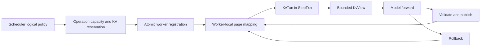

# KV cache management

UniServe separates scheduler-owned logical KV policy from worker-owned physical KV storage. The Rust engine owns logical block identity, request capacity, prefix reuse, reference counts, and eviction policy. Each Python worker independently binds those logical blocks to pages in its own resident K/V tensors and owns page readiness, transaction state, snapshots, and reclamation.

## Authority boundary

| State or decision | Authority | Canonical implementation |
| --- | --- | --- |
| Logical block IDs, leases, prefix hashes, sharing, and eviction | Rust engine | `BlockManager` and scheduler prefix-cache policy |
| Request lineage, operation identity, and committed sequence cursor | Rust scheduler and worker protocol | `Admission`, `Operation`, and ordered controls |
| Logical lease registration | Worker protocol | `BatchPartition.kv_reservations` |
| Logical-to-physical page mapping | Python worker | `KvStore` |
| Resident K/V tensors and quantization metadata | Python worker | `PagedKVPool` |
| Committed worker block tables, prefix boundaries, and lengths | Python worker | `KvStore` |
| Per-operation provisional writes | Python worker | `KvTxn` within `StepTxn` |
| Model-visible cache access | Python worker | Bounded `KvView` in `ForwardContext` |
| Durable worker recovery | Python worker | `SnapshotProvider` |

A model receives only the bounded view and immutable attention plan for its current `ForwardBatch`. It does not allocate pages, assign logical blocks, advance committed lengths, perform prefix-cache policy, or decide rollback.

## Registration and execution



`Admission` establishes semantic KV metadata: the exact read-only prefix length and cache group. `Operation` carries its finite KV growth bound and exact logical page capacity. A `KvReservation` sidecar in the same partition binds `(request_key, op_id)` to the logical pages that worker must add: the complete lease on that worker's admission and only subsequent growth thereafter. The worker validates the resulting capacity against the operation and selects physical pages atomically. The sidecar is scheduling metadata and never contributes physical placement to the plan digest.

`ModelExecutor` opens the request transaction before admission and registration. `KvStore` resolves each `(group_id, logical_block)` to a page selected from the local `PagedKVPool`, validates prefix sharing and writable ownership, and publishes the mapping only as part of successful registration. Any later registration, store, staging, or execution failure restores the prior session state and returns every page acquired by the transaction.

## Semantic identity

The operation plan digest covers the exact parent, work, route, domain, state effect, finite bounds, ordered products, logical KV capacity, predicate, RNG coordinates, and control sequence. It excludes logical reservation values, physical page IDs, batch and partition position, completion slots, streams, events, topology order, and transport allocation.

The completion semantic digest binds the parent semantic digest, plan digest, selected point, status, committed logical lengths, token span and values, finish flags, and product generations. Control content uses its own canonical identity and digest. Batching, worker page selection, pipeline depth, topology submission order, and completion observation order therefore cannot change semantic identity.

## Logical blocks and prefix reuse

The engine partitions request capacity into fixed-size logical blocks. Each cache group owns its free queue and block metadata. Allocation takes logical blocks from the group queue; release decrements references and makes unreferenced blocks eligible for logical reuse.

Full prompt blocks may be published under chained hashes that include the preceding hash, cache group, modality tag, token count, and exact tokens. Lookup walks the prompt from the beginning and stops at the first miss. A candidate hit is accepted only after exact token verification, so a hash collision cannot cause incorrect K/V reuse.

Workers preserve sharing by mapping the same `(group_id, logical_block)` to the same local physical page. Every full block below `prefix_len` is read-only and may have multiple session holders. Blocks at or beyond that boundary must have a single writable holder. Different workers may map the same logical lease to entirely different page numbers.

## Physical storage

`PagedKVPool` owns layer-major key and value tensors with shape:

```text
[num_layers, num_blocks, block_size, num_kv_heads, head_dim]
```

Only worker-selected page IDs index the physical block axis. The pool validates page indices, tensor geometry, and logical spans on every cold-path operation. Reads may return a view or a materialized tensor, so callers treat them as read-only.

Optional FP8 storage uses per-layer, per-page scale tables. A page scale is established on its first write and reused for later appends. Paged-attention providers are selected only when the bounded view declares that its storage representation is directly consumable.

## Bounded forward views

The `KvView` protocol exposes block size, committed base lengths, storage capability, per-layer K/V tensors, and validated fixed, ragged, or packed append operations. `ModelExecutor` prepares block tables, committed sequence lengths, query offsets, and packed write locations from transaction state. These values are immutable attention-plan inputs for the forward call. Mixed-compatible rows share one view and one model invocation while retaining row-aligned write plans.

Graph capture remains request-identity-free. `GraphStore` keys captures by immutable model revision, resolved spec, route, shape, dtype, backend, and topology; replay refreshes live tensor inputs and attention metadata.

## Transaction and commit semantics

`StepTxn` acquires each affected session's single-writer lock and composes the K/V, latent, and product store transactions used by the operation. The K/V transaction records page-binding changes, retains overwritten page content required for restoration, applies provisional writes, and validates the final lease and length state before publication.

Commit follows prepare, publish, and finalize phases. Replay publication and store publication occur under the same transaction boundary. If registration, validation, staging, forward execution, communication, sampling, postprocessing, or publication fails, rollback restores the prior session, logical mapping, physical page ownership, K/V content, and scratch state.

## Sequence operations

Sequence extend, decode, and verify operations declare their input span, finite KV growth bound, and exact logical capacity. `ModelExecutor` checks that an operation begins at the committed cursor, builds the attention plan, runs the model, validates row-aligned output, applies sampling or verification, and advances the transaction only by the committed token effect.

Prefix reads and new writes may coexist in one attention operation, but the model cannot mutate the committed length. The length becomes visible only when the enclosing transaction publishes.

## Flow scratch

Flow branches use generation-scoped scratch entries owned by `KvStore`. Conditional K/V may be copied into a branch when the declared flow policy requires it. Text-unconditional and image-unconditional branches receive separate scratch block tables, may execute in the same packed forward, and are reclaimed after completion or rollback.

Scratch capacity and branch identity are independent of the model package. Flow models return raw predictions and do not own K/V branch lifecycle.

## Publication, snapshot, and recovery

A KV publication names an exact source version, semantic digest, destination, base version, committed extent, logical lease, source-worker page mapping, cache group, mapping generation, and scale identity. Transfer tensors contain only the incremental committed suffix. A consumer validates the logical base and writes the suffix through its already registered local page mapping; source page numbers never become destination placement.

A durable worker snapshot records each selected session's logical lease, resident page contents, prefix boundary, committed extents, cache group, quantization scales, publications, and flow-branch pages together with session, latent, product, adapter, and replay state. Restore validates the complete snapshot, resolves logical blocks in the destination pool, copies verified page data into those pages, and publishes the reconstructed sessions atomically.

## Capacity and cleanup

The engine admits work only when logical capacity and the declared resource plan can cover it. Each worker independently verifies that registration fits its physical pool. Session close removes page holders and releases branch and transport resources. Established logical-to-physical mappings remain bound so reassignment of the same logical block reuses its page and prefix content.

Operational health reports distinguish scheduler logical allocation and prefix reuse from worker physical residency, scratch capacity, and transaction failures. Session close removes live holders while preserving each established logical-to-physical mapping, so a later lease of the same logical block reuses the page and its prefix content. After all requests terminate, live holders and scratch allocation must be zero.
