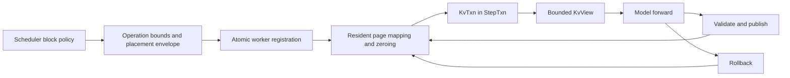

# KV cache management

UniServe separates scheduler allocation policy from worker-resident tensor ownership. The Rust engine assigns request capacity, cache groups, stable block identities, complete per-operation block tables, prefix references, and release order. Each Python worker maps those scheduler block identities into its resident K/V tensor pool and owns device readiness, transaction state, publications, snapshots, and reclamation.

## Authority boundary

| State or decision | Authority | Canonical implementation |
| --- | --- | --- |
| Block identities, request leases, prefix hashes, sharing, and eviction | Rust engine | `BlockManager` and scheduler prefix-cache policy |
| Request lineage, operation identity, and committed sequence cursor | Rust scheduler and worker protocol | `Admission`, `Operation`, and ordered controls |
| Complete block table, cache group, and pages to zero | Rust scheduler and worker protocol | `BatchPartition.kv_placements` |
| Scheduler-block to resident-page mapping | Python worker | `KvStore` |
| Resident K/V tensors and quantization metadata | Python worker | `PagedKVPool` |
| Prefix boundaries and reserved, initialized, visible, committed, and published extents | Python worker | `KvStore` |
| Per-operation provisional writes | Python worker | `KvTxn` within `StepTxn` |
| Model-visible cache access | Python worker | Bounded `KvView` in `ForwardContext` |
| Durable worker recovery | Python worker | `SnapshotProvider` |

A model receives only the bounded view and immutable attention plan for its current `ForwardBatch`. It does not allocate pages, assign scheduler blocks, advance committed lengths, perform prefix-cache policy, or decide rollback.

## Registration and execution



`Admission` establishes the request-pool row, exact read-only prefix length, cache group, sampling state, and generation parameters. `Operation` carries finite KV growth bounds and exact block-table capacity. A `KvPlacement` sidecar binds `(request_key, op_id)` to the complete scheduler block table, cache group, and exact newly assigned pages that require zeroing. Placement is execution metadata and does not contribute to admission, plan, semantic, or control identity.

`ModelExecutor` opens the request transaction before admission and placement registration. `KvTxn.apply_placement` validates that the block-table prefix equals the committed mapping, the declared group equals admission metadata, the table establishes the operation capacity, and every page-to-zero belongs to the newly assigned suffix. `KvStore` then resolves each scheduler block to one resident page, preserves shared prefix mappings, zeros the selected resident pages asynchronously on their device, and publishes the mapping only as part of successful registration. A later registration, staging, execution, or publication failure restores the prior session and mapping state and returns pages acquired by the transaction.

## Semantic identity

The operation plan digest covers the exact parent, work, route, domain, state effect, finite bounds, ordered products, KV capacity, predicate, RNG coordinates, and control sequence. It excludes scheduler block IDs, resident page IDs, request-pool indices, batch and partition position, completion slots, streams, events, topology order, and transport allocation.

The completion semantic digest binds the parent semantic digest, plan digest, selected point, status, committed logical lengths, token span and values, finish flags, and product generations. Control content uses its own canonical identity and digest. Batching, allocation, pipeline depth, topology submission order, and completion observation order therefore cannot change semantic identity.

## Block allocation and prefix reuse

The engine partitions request capacity into fixed-size blocks. Each cache group owns a free queue and block metadata. Allocation takes blocks from the group queue; release decrements references and makes unreferenced blocks eligible for reuse only after ordered worker retirement.

Full prompt blocks may be published under chained hashes that include the preceding hash, cache group, modality tag, token count, and exact tokens. Lookup walks the prompt from the beginning and stops at the first miss. A candidate hit is accepted only after exact token verification, so a hash collision cannot cause incorrect K/V reuse.

Workers preserve prefix sharing by mapping the same `(group_id, scheduler_block)` to the same resident page. Every full block below `prefix_len` is read-only and may have multiple session holders. Blocks at or beyond that boundary have one writable holder. A scheduler block reassigned to unrelated content appears in `pages_to_zero`; a prefix-cache hit does not.

## Resident storage

`PagedKVPool` owns layer-major key and value tensors with shape:

```text
[num_layers, num_blocks, block_size, num_kv_heads, head_dim]
```

Resident page IDs index the physical block axis. The pool validates page indices and tensor geometry on cold-path operations. Reads may return a view or a materialized tensor, so callers consume them as read-only.

Optional FP8 storage uses per-layer, per-page scale tables. Page zeroing clears stored values and resets scale state. A page scale is established on its first subsequent write and reused for later appends. Paged-attention providers are selected only when the bounded view declares that its storage representation is directly consumable.

## Bounded forward views

The `KvView` protocol exposes block size, committed base lengths, storage capability, per-layer K/V tensors, and validated fixed, ragged, or packed append operations. `ModelExecutor` prepares resident block tables, committed sequence lengths, query offsets, and packed write locations from transaction state. These values are immutable attention-plan inputs for the forward call. Mixed-compatible rows share one view and one model invocation while retaining row-aligned write plans.

Graph capture remains request-identity-free. `GraphStore` keys captures by immutable model revision, resolved spec, route, shape, dtype, backend, and topology; replay refreshes live tensor inputs and attention metadata.

## Transaction and commit semantics

`StepTxn` acquires each affected session's single-writer lock and composes the K/V, latent, and product transactions used by the operation. The K/V transaction records mapping changes, retains overwritten page content required for restoration, applies provisional writes, and validates the final capacity and extent state before publication.

Commit follows prepare, publish, and finalize phases. Replay publication and store publication occur under the same transaction boundary. If registration, validation, staging, forward execution, communication, sampling, postprocessing, or publication fails, rollback restores the prior session, scheduler-block mapping, resident page ownership, K/V content, and scratch state.

## Sequence operations

Sequence extend, decode, and verify operations declare their input span, finite KV growth bound, and exact capacity. `ModelExecutor` checks that an operation begins at the committed cursor, builds the attention plan, runs the model, validates row-aligned output, applies sampling or verification, and advances the transaction only by the committed token effect.

Prefix reads and new writes may coexist in one attention operation, but the model cannot mutate the committed length. The length becomes visible only when the enclosing transaction publishes.

## Flow scratch

Flow branches use generation-scoped scratch entries owned by `KvStore`. Conditional K/V may be copied into a branch when the declared flow policy requires it. Text-unconditional and image-unconditional branches receive separate scratch block tables, may execute in the same packed forward, and are reclaimed after completion or rollback.

Scratch capacity and branch identity are independent of the model package. Flow models return raw predictions and do not own K/V branch lifecycle.
