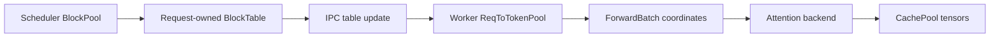

# KV cache management

UniServe uses one scheduler-owned physical page address space for every persistent KV sequence and one worker execution image of that state. Conversational history, generation conditioning, alternative classifier-free-guidance (CFG) prefixes, transfer installation, and recovery all use the same block-table layout.

## Ownership

| Concern | Owner | Canonical representation |
| --- | --- | --- |
| Physical page availability and references | Scheduler `BlockPool` | Reference-counted physical page locations |
| One cached sequence | Scheduler request or flow state | One `BlockTable` per cache group |
| Prefix matching and cross-group retention | Scheduler `KvCacheCoordinator` | Prefix keys and group-specific matches |
| Request-slot page mappings | Worker `ReqToTokenPool` | Group/request-indexed page-table tensor |
| Materialized and allocated KV lengths | Worker `ReqToTokenPool` | `verified_lens` and `alloced_lens` |
| Layer K/V tensors | Worker `CachePool` | Layer-major physical page storage |
| Attention visibility for one call | `ForwardBatch` | Row-aligned `seq_lens` |
| Current-token persistence | `ForwardBatch` | Packed `out_cache_loc` values |
| Destination publication progress | Publication registry | Destination base and published extent |
| Durable recovery data | Snapshot storage | Dense visible tensors and semantic request state |

The scheduler is authoritative for page ownership. A worker installs complete scheduler-issued block tables into `ReqToTokenPool`; kernel indices and attention metadata are derived from that execution image and are not persistent sequence state.

## Physical page storage

`CachePool` is created once from the model cache geometry and worker capacity. Its K/V tensors have the logical shape:

```text
[layer, physical_page, page_token, kv_head, head_dimension]
```

Page `0` is reserved as the padding sentinel. Positive page IDs belong to declared cache-group ranges, such as separate Full-attention and sliding-window-attention ranges. Request lifetime and flow lifetime do not create physical subspaces.

`CachePool` provides page-level reset, copy, read, write, export, and restore operations. It owns tensor storage and storage-dtype metadata; it does not own request slots, request page tables, logical sequence positions, or allocation policy.

## Scheduler tables and worker installation

A scheduler `BlockTable` maps one cached sequence's logical blocks to physical pages and records its allocated token capacity. Scheduler request state owns the conversational tables. A distinct alternative CFG prefix owns ordinary tables for the lifetime of the flow operation. Reference-counted page handles keep shared prefixes live until their last owning table is released.

The IPC representation of every table is:

```text
request_pool_idx
group_id
page_ids
allocated_tokens
```

Newly allocated page IDs travel separately so the worker can reset their contents and quantization metadata before first use. `ReqToTokenPool` installs each complete table into the declared request slot, tracks its allocated and verified lengths, and clears the slot before reuse.



## Forward execution

`ForwardBatch` is the model-facing execution input. Its KV core consists of `forward_mode`, `req_pool_indices`, `seq_lens`, `query_lens`, and `out_cache_loc`.

Each packed current token has one `out_cache_loc`. Zero means its K/V is available to the current attention call but is not persisted. A positive value encodes a physical page and page offset in `CachePool`. Text extend and decode rows use positive destinations for selected current tokens; denoise image rows use zero destinations.

`ForwardRow` is the CPU packing record for one model row. It carries the request-pool index, historical sequence length, query length, and persistence choice. Multiple rows may reference the same request slot, including CFG branches that share conversational conditioning.

Sequence length has one owner for each meaning:

| Meaning | Source |
| --- | --- |
| Allocated capacity | Scheduler `BlockTable` and worker `ReqToTokenPool.alloced_lens` |
| Contiguous computed KV | `ReqToTokenPool.verified_lens` |
| Historical KV visible to one call | `ForwardBatch.seq_lens` |
| Selected semantic KV position | Selected request version and completion `kv_visible_len` |
| Materialized speculative position | Completion `kv_computed_len` |
| Published destination progress | Publication registry extent |

Speculative verification may compute KV beyond the selected semantic point. In that case `kv_computed_len` and `verified_lens` record the materialized boundary while `kv_visible_len` records the selected boundary.

## Segmented attention

Image-generation attention treats the paged conditioning prefix and dense current image K/V as segments of one logical sequence. Both segments evaluate the same query and return output with log-sum-exp state. A stable online-softmax merge combines those states, making the result equivalent to dense attention over `[prefix | current]`.

The prefix length is independent of page boundaries. Causal text rows expose current positions incrementally; denoise rows expose the complete current image segment. Because denoise output locations are zero, image K/V participates only in the active forward and does not consume persistent pages.

Backend startup qualification selects segmented attention only when the provider supports paged-prefix attention, dense-current attention, LSE return, stable merge, the active dtype, and the active head geometry.

## Generation flow

Every CFG branch resolves to a cached prefix slot:

1. A branch using conversational conditioning references the main request slot.
2. Branches using the same conditioning share that slot and its pages.
3. A distinct negative or alternative text prefix receives another request slot and ordinary pages from the common `BlockPool`.
4. The distinct prefix is prefetched once and reused for each denoise step in the flow operation.
5. Flow completion, cancellation, or failure releases its alternative-prefix slot and block tables while leaving request-owned conversational tables live.

Persistent KV admission therefore counts request pages plus pages for distinct materialized alternative prefixes. Dense denoise tokens and duplicate CFG views do not add persistent KV capacity.

## Publication and transfer

KV publication names a source request slot, cache group, semantic source version, destination, base extent, and published extent. The publication registry resolves the source pages through `ReqToTokenPool` and publishes only the suffix beyond the installed destination base.

The immutable publication manifest contains transport locators, semantic versions, destination, extents, group identity, and storage identity. Physical source page IDs remain local to the source worker. Installation resolves the scheduler-assigned destination table, writes the transferred suffix into `CachePool`, advances the destination verified length, and reports the installed selected and computed lengths.

## Recovery

Snapshot creation validates scheduler-supplied recovery tables against the committed request state, resolves their installed mappings through `ReqToTokenPool`, and serializes only the visible dense K/V range for each cache group. Semantic request state, publication state, latent state, and transport-owned assets retain their respective owners.

Restore receives fresh scheduler-issued block tables, installs them into `ReqToTokenPool`, writes the serialized tensors into the assigned `CachePool` pages, restores allocated and verified lengths, and then publishes the recovered request state. Physical page IDs and request slots are placement rather than durable identity.

## CUDA graph execution

Captured forwards use fixed tensor bases and stage request-variable indices, sequence lengths, query lengths, output locations, and padded table tails before replay. Padding references page `0`. One qualified graph shape can therefore execute different scheduler placements without embedding request ownership into the capture.
