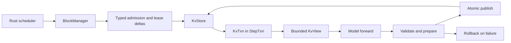

# KV cache management

UniServe separates logical allocation from physical storage. The Rust engine owns block identity, request admission, prefix reuse, reference counts, eviction, and scheduler-visible capacity. The Python worker owns resident K/V tensors, committed block tables and lengths, transaction scratch, bounded forward views, snapshots, and physical reclamation.

## Authority boundary

| State or decision | Authority | Canonical implementation |
| --- | --- | --- |
| Logical block IDs, leases, prefix hashes, sharing, and eviction | Rust engine | `BlockManager` and scheduler prefix-cache policy |
| Request admission and committed sequence cursor | Rust scheduler and worker protocol | Typed `Admission` and sequence operations |
| Resident K/V tensors and quantization metadata | Python worker | `PagedKVPool` |
| Committed worker block tables, prefix boundaries, and lengths | Python worker | `KvStore` |
| Per-operation provisional writes | Python worker | `KvTxn` within `StepTxn` |
| Model-visible cache access | Python worker | Bounded `KvView` in `ForwardContext` |
| Durable worker recovery | Python worker | `SnapshotProvider` |

A model never allocates blocks, advances a committed length, performs prefix-cache policy, owns a request cache, or decides rollback. It receives only the bounded view and immutable attention plan for its current `ForwardBatch`.

## Execution flow



The engine sends block identities only through typed admissions and lease deltas. `KvStore` validates the lease against the session, group, prefix boundary, pool capacity, and existing holders before a forward plan is built. `ModelExecutor` opens one `StepTxn`, obtains a `KvTxn`, lowers compatible operations into route-level work, and exposes only transaction-bounded cache access to the model.

## Logical blocks and prefix reuse

The engine partitions K/V capacity into fixed-size logical blocks. Each cache group owns its free queue and block metadata. Allocation takes blocks from the free queue; release decrements references and returns unreferenced blocks to the queue.

Full prompt blocks may be published under chained hashes that include the prior hash, cache group, modality tag, token count, and exact tokens. Lookup walks the prompt from the beginning and stops at the first miss. A candidate hit is accepted only after exact token verification, so a hash collision cannot cause incorrect K/V reuse.

A reused admission carries the shared block IDs and a `prefix_len`. The worker treats every position below that boundary as read-only. Successor writes use newly leased capacity, which preserves shared prefixes and enforces copy-on-write at the logical block boundary.

## Physical storage

`PagedKVPool` owns layer-major key and value tensors with shape:

```text
[num_layers, num_blocks, block_size, num_kv_heads, head_dim]
```

Logical block IDs index the physical block axis directly. The pool validates layer indices, block IDs, tensor geometry, and logical spans on every cold-path operation. Reads may return a view or a materialized tensor, so callers must treat them as read-only.

Optional FP8 storage uses per-layer, per-block scale tables. A block scale is established on its first write and reused for later appends. Paged-attention providers are selected only when the bounded view declares that its storage representation is directly consumable.

## Bounded forward views

The `KvView` protocol exposes only:

- Block size and committed base lengths.
- Whether paged-attention providers can consume the storage directly.
- Per-layer K/V tensors.
- Validated fixed, ragged, or packed append operations.

Block tables, committed sequence lengths, query offsets, and packed write locations are prepared by `ModelExecutor` from the transaction state. They are immutable attention-plan inputs for the forward call. Mixed-compatible rows share one view and one model invocation while retaining row-aligned write plans.

Graph capture remains request-identity-free. `GraphStore` keys captures by immutable model revision, resolved spec, route, shape, dtype, backend, and topology; replay refreshes live tensor inputs and attention metadata. A capture or replay failure returns to the equivalent eager route within the same runner call.

## Transaction and commit semantics

`StepTxn` acquires each affected session's single-writer lock and composes the K/V, latent, and product store transactions used by the operation. The K/V transaction retains the prior pages needed for restoration, applies provisional writes, and validates the final block and length state before publication.

Commit follows prepare, publish, and finalize phases. Replay publication and store publication occur under the same transaction boundary. If validation, staging, forward execution, communication, sampling, postprocessing, or publication fails, rollback restores the prior session and K/V state and releases scratch. A retry with the same operation identity therefore starts from the same committed cache and semantic RNG coordinates.

## Sequence operations

Sequence extend, decode, and verify operations declare their input span and K/V lease delta. `ModelExecutor` checks that the operation begins at the committed cursor, builds the attention plan, runs the model, validates row-aligned output, applies sampling or verification, and advances the transaction only by the committed token effect.

Prefix reads and new writes may coexist in one attention operation, but the model cannot mutate the committed length. The length becomes visible only when the enclosing transaction publishes.

## Flow scratch

Flow branches use generation-scoped scratch entries owned by `KvStore`. Conditional K/V may be copied into a branch when the declared flow policy requires it. Text-unconditional and image-unconditional branches receive separate scratch block tables, may execute in the same packed forward, and are reclaimed by the system after completion or rollback.

Scratch capacity and branch identity are independent of the model package. Flow models return raw predictions; they do not own K/V branch lifecycle.

## Snapshot and recovery

A worker snapshot records each selected session's committed block table, prefix boundary, length, cache group, resident page contents, quantization scales, and flow-branch pages together with session, latent, product, adapter, and replay state. Snapshot identity binds the resolved model spec, weight digest, topology, and format version.

Restore validates the complete snapshot in scratch, provisions physical resources through the stores, copies verified page data into the destination pool, and publishes the reconstructed sessions atomically. An incomplete or incompatible snapshot does not publish partial K/V state.

## Capacity and cleanup

The engine admits work only when logical capacity and the declared resource plan can cover it. The worker validates that every lease fits the provisioned physical pools. Cancellation, terminal completion, stale work, and unrecoverable worker loss converge on system-owned cleanup that releases committed blocks, scratch branches, replay records, and related products idempotently.

Operational health should report zero live request state and zero scratch allocation after all requests terminate. Cache metrics distinguish logical allocation and prefix reuse from worker-side physical residency and transaction failures.
