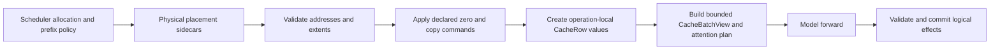

# KV cache management

UniServe uses one physical KV address space from scheduler allocation through model execution. The Rust engine is the sole authority for request slots, request KV pages, prefix sharing, generation scratch pages, copy commands, recovery destinations, and release order. Each Python worker owns fixed K/V tensors at those addresses and applies only the explicit physical commands carried by the protocol.

## Authority boundary

| State or decision | Authority | Canonical representation |
| --- | --- | --- |
| Request slots, KV page leases, cache groups, prefix hashes, sharing, eviction, and ordered release | Rust engine | Scheduler resource managers |
| Request lineage, operation identity, committed cursor, and logical lengths | Rust scheduler and worker protocol | `Admission`, `Operation`, ordered controls, and completion records |
| Complete operation block tables, zero commands, and logical KV extents | Rust scheduler and worker protocol | `BatchPartition.kv_placements` |
| Generation branch block tables and zero commands | Rust scheduler and worker protocol | `BatchPartition.kv_branch_placements` |
| Page-copy source and destination addresses | Rust scheduler and worker protocol | `CacheCopy` |
| Recovery request slot, cache groups, page tables, and extents | Rust scheduler and worker protocol | `RecoveryPlacement` |
| Fixed K/V tensors and quantization metadata | Python worker | `CachePool` |
| Operation-local extent cursors | Python worker | `CacheRow` |
| Model-visible cache access | Python worker | `CacheBatchView` through `ForwardContext.kv` |
| Durable state serialization | Python worker | `SnapshotProvider` |

A model receives only the bounded cache view and immutable attention plan for its current `ForwardBatch`. It cannot allocate pages, change block tables, advance committed lengths, perform prefix-cache policy, or choose recovery addresses.

## Physical address space

Each worker creates `CachePool` once from the model cache geometry and scheduler-advertised capacity. Key and value tensors have shape:

```text
[layer, physical_page, page_token, kv_head, head_dimension]
```

Page `0` is the immutable zero sentinel used for padded graph rows and block-table tails. Request pages occupy the positive range below `scratch_page_offset`; generation scratch pages occupy the range from `scratch_page_offset` to `num_pages - 1`. Cache-group ranges partition the request-page axis, and every command must name the group that owns its global page IDs. A physical page ID is interpreted directly on every tensor-parallel rank.

The pool validates cache groups, page ranges, request-versus-scratch regions, repeated real pages, layer indices, tensor geometry, and token spans before mutation. It provides explicit zero, copy, read, write, page-view, and restore operations. It has no allocation, eviction, sharing, lease, or reclamation API.

Optional FP8 storage uses group-, layer-, and page-indexed scale tables. Zeroing a page clears its values and resets its scale state. The first subsequent write establishes the page scale, and later appends use the established scale. Paged-attention providers are selected only when the model-facing view declares that its storage representation is directly consumable.

## Placement and execution



`Admission` establishes the stable request-pool row and logical prefix state. Each token operation declares a finite KV page capacity in its semantic operation record. Its `KvPlacement` sidecar binds `(request_key, op_id, group_id)` to the complete physical block table, exact pages to zero, prefix length, input length, visible length, and resulting length. Physical placement is execution metadata and does not contribute to admission, plan, semantic, or control identity.

Before any page mutation, `ModelExecutor` validates every placement against the operation, fixed pool geometry, request region, capacity, and logical parent state. It then zeroes exactly `pages_to_zero` and constructs a `CacheRow` whose reserved, initialized, visible, committed, and published extents are bounded by the scheduler block table. Registration or staging failure cannot publish an operation or session transition.

`CacheBatchView` derives block tables, cache sequence lengths, packed write coordinates, and layer cache tensors from the operation-local rows. Fixed, ragged, and packed append methods validate row alignment and write only the declared physical spans. The model can append K/V values but cannot change the row cursor; the executor advances and commits logical extents after validating the model and postprocessing results.

## Allocation, prefix reuse, and zeroing

The engine partitions each cache group into fixed-size physical pages. Allocation takes pages from the group free queue. Release decrements references and makes an unreferenced page eligible for reuse only after ordered worker retirement.

Full prompt pages may be published under chained hashes containing the preceding hash, cache group, modality tag, token count, and exact tokens. Lookup walks from the beginning and stops at the first miss. A candidate hit is accepted only after exact token verification. Shared prefix holders therefore receive the same physical page IDs, while writable suffix pages remain exclusive.

Every page assigned to unrelated content is included in `pages_to_zero`. The worker clears all layer, key, value, and quantization state for that physical page before the operation can write it. Prefix hits are not zeroed.

## Semantic identity

The operation plan digest covers the exact parent, work, route, domain, state effect, finite bounds, ordered products, logical KV capacity, predicate, RNG coordinates, and control sequence. It excludes physical page IDs, request-pool indices, batch and partition position, completion slots, streams, events, topology order, and transport allocation.

The completion semantic digest binds the parent semantic digest, plan digest, selected point, status, committed logical lengths, token span and values, finish flags, and product generations. Batching, placement, pipeline depth, topology submission order, and completion observation order cannot change semantic identity.

## Sequence and generation work

Sequence extend, decode, and verify operations declare their input span, finite KV growth bound, exact capacity, and physical placement. The executor checks that each operation starts at its parent cursor, creates the attention plan, runs the model, validates row-aligned output, applies sampling or verification, and advances only by the selected token effect.

Generation branches receive `KvBranchPlacement` records in the scratch region. Conditional state is copied from the request table to a named branch table only through explicit physical page copies. Text-unconditional and image-unconditional branches use disjoint scheduler assignments and may participate in one packed forward. Scratch tables are operation-scoped and never become request allocation state.

## Publication and transfer

KV publication records bind an exact fixed semantic version and extent to a destination, cache group, storage identity, and source page prefix. The worker publishes only the suffix after the destination's installed base. Installation writes prepared transfer tensors into the consuming operation's scheduler-assigned block table and records the local physical pages in the installed publication.

Publication and installation metadata are prepared within the execution scope. They become resident only after completion validation and the session/replay transaction succeeds. Failed staging or execution releases prepared transport locators and cannot advance the installed or published base.

## Copy and recovery

`CacheCopy` names one cache group and aligned source and destination page sequences. The worker validates the complete command before copying all K/V and quantization fields. It does not infer either side from request lineage.

Snapshots serialize committed session state together with the exact cache bytes selected by a scheduler-supplied `RecoveryPlacement`. Restore requires another explicit placement covering every cache group with the committed logical extent. The worker writes the serialized bytes into those destination pages and rebinds the session to the supplied request slot. Worker replacement starts with empty physical state; affected sessions remain terminated until the scheduler supplies a valid recovery operation.

## Graph execution

Captured attention receives request-variable state only through fixed pool bases and staged physical indices. Block-table padding repeats page `0`, and graph replay overwrites live table entries, sequence lengths, write coordinates, and padded tails before execution. Physical placement remains outside semantic identity, so one qualified graph shape can execute different requests without embedding request ownership in the capture.
